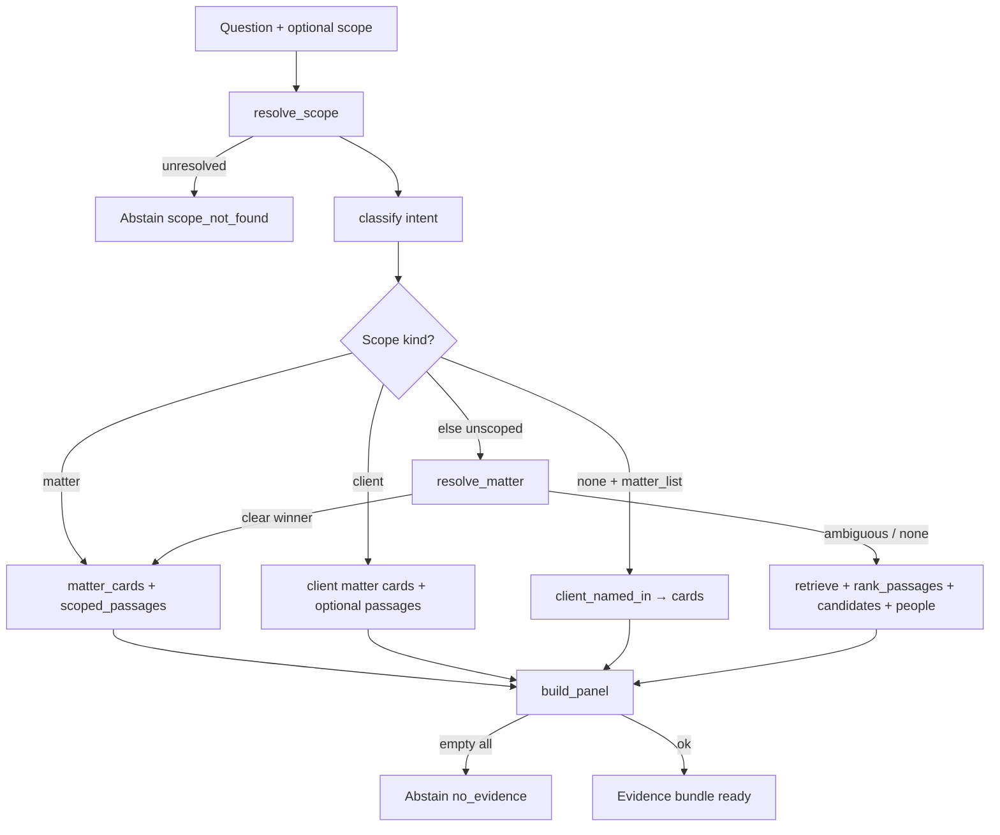

# Ask the Firm architecture — in depth

How **Ask the Firm** (the KM desk) is built: scope → intent → ACL-filtered evidence → one LLM answer → optional claim grounding → DMS envelope + panel. Shared core with the Assistant’s `ask_firm` tool; different entry, streaming, and UI.

> Companions: platform map [`SYSTEM_ARCHITECTURE.md`](SYSTEM_ARCHITECTURE.md); Assistant deep dive [`ASSISTANT_ARCHITECTURE.md`](ASSISTANT_ARCHITECTURE.md); product plan [`plan/15_km_desk_and_assistant_scale.md`](plan/15_km_desk_and_assistant_scale.md).

---

## 1. What Ask the Firm is (and is not)

| | **Ask the Firm** | **Assistant** |
|--|------------------|---------------|
| Product job | KM desk: which matter, who, which docs, facts | Reasoning, drafting, review, long-doc work |
| UI | `/ask` → `AskPage` | `/chat` → `ChatPage` |
| API | `POST /api/answers` (+ `/stream`) | `POST /api/chat/sessions/{id}/messages` |
| Loop | **One pipeline** — no tool agent | Multi-round tool agent |
| Citations | Firm ids `DOC-` / `MTR-` / `MEM-` (+ span `[n]` after grounding) | Chat-local `doc-N` + chat grounding |
| History | `ask_history` (question + scope only) | Full chat sessions / messages |
| Bridge | Shared `app/km/` | Tool `ask_firm` calls `ask_the_firm(...)` |

**North star:** given tens of thousands of documents across hundreds of matters, surface the **correct institutional knowledge** under **ACL before ranking**, then produce an **evidence-backed** answer — not “can an LLM talk about these PDFs?”

Ask answers: *which matters, which documents, who worked on it, what the records say.*  
Assistant answers: *draft, edit, review, reason across many / long documents* — and **calls Ask** when it needs the KM desk.

---

## 2. Big picture

```text
┌────────────────────────────────────────────────────────────────────────────┐
│  Browser SPA                                                               │
│  AskPage · AskComposer · AIAnswer / AIStreaming · KmPanel · AnswerContext  │
│  frontend/src/api/ask.ts  →  streamAsk / useAskStream                      │
└───────────────────────────────┬────────────────────────────────────────────┘
                                │ POST /api/answers/stream
                                │ SSE: evidence → key_finding → delta* → verifying → final
┌───────────────────────────────▼────────────────────────────────────────────┐
│  answers router  (app/api/routers/answers.py)                              │
│  rate limit → remember history → ask_the_firm_stream → publish DMS envelope│
└───────────────────────────────┬────────────────────────────────────────────┘
                                │
┌───────────────────────────────▼────────────────────────────────────────────┐
│  app/km/answer.py                                                          │
│  gather_evidence (no LLM) → pack → LLM → validate citations → _finish      │
│  (_ground if grounding_enabled) → panel mark_cited                         │
└───┬──────────┬──────────┬──────────┬──────────┬──────────┬─────────────────┘
    │          │          │          │          │          │
    ▼          ▼          ▼          ▼          ▼          ▼
 scope.py   intent.py  directory  passages   resolver   panel.py
 ACL SQL    classify   matter     scoped /   matter     KM desk
           people/    cards +    unscoped   IDF+embed  matters/
           overview   people     retrieve              docs/people
```

Also: Assistant `ask_firm_tool` → **same** `ask_the_firm` (non-streaming), then remaps passages to `doc-N` for the chat agent.

Infrastructure: Postgres+pgvector, Redis (rate limit + caches), Bedrock (answer + verifier), MiniLM embeddings for scoped / profile vectors. No separate Ask microservice.

---

## 3. Entry points

### 3.1 HTTP — `app/api/routers/answers.py` (`/api/answers`)

| Method | Path | Role |
|--------|------|------|
| `POST` | `/api/answers` | Sync JSON — `ask_the_firm` |
| `POST` | `/api/answers/stream` | SSE — `ask_the_firm_stream` (what the SPA uses) |
| `GET` | `/api/answers/history` | Recent questions for this member |
| `DELETE` | `/api/answers/history/{id}` | Remove one |
| `DELETE` | `/api/answers/history` | Clear all |
| `GET` | `/api/answers/health` | Liveness |

**Request** (`AskRequest` in `app/api/schemas.py`):

```text
query: str
k: int = 10                    # accepted; KM uses its own internal k
scope: { type, value } | null  # type: matter | client | auto
```

Both POSTs: `check_rate_limit` (`rate_limit_ask_per_minute`, default 30) → `ask_history.record` → KM → `_publish` (metrics, DMS format, audit).

Auth: `Depends(resolve_member)` (OIDC / API key / trusted `X-Member-Id` in dev).

### 3.2 Frontend

| Piece | Path | Role |
|-------|------|------|
| Page | `frontend/src/pages/AskPage.tsx` | `/ask?q=&scope=&scopeType=` |
| Composer | `components/ai/AskComposer.tsx` | Navigate to Ask URL |
| Client | `frontend/src/api/ask.ts` | `streamAsk`, `useAskStream`, history CRUD |
| Answer | `components/ai/AIAnswer.tsx` | Assembling / streaming / final / abstain |
| Panel | `components/ai/KmPanel.tsx` | Matters · Documents · People + “Continue in the Assistant” |

Phases in `useAskStream`: `idle` → `gathering` → `writing` → `verifying` → `done` | `error`.

### 3.3 Assistant bridge

`app/chat/tools/firm_tools.py` → `ask_firm_tool` → `ask_the_firm` (sync).  
Schema: `ASK_FIRM` in `app/chat/tools/schema.py`.  
Tool timeout ≥ ~75s. Does **not** write ask_history. Returns a compact tool payload (`draft_answer`, `key_finding`, passages as `doc-N`, matters, people) for the agent to refine and cite.

---

## 4. Pipeline — stage by stage

Core orchestrator: `app/km/answer.py`.

### 4.1 `gather_evidence` (no LLM)



1. Empty query → `no_evidence`, done.
2. **`resolve_scope`** (`scope.py`) — structured `{type,value}`, `"Matter: …"` / `"Client: …"` prefixes, or inline matter codes in the question.
3. **`classify`** (`intent.py`) → `KMIntent(people, overview, matter_list)` (regex; overview also if scoped and ≤3 words).
4. Unresolved scope → abstain `scope_not_found`.
5. Collect **matter cards**, **people**, **passages**, **candidates** under ACL (see §5–6).
6. **`build_panel`** — KM desk payload for the UI.
7. If nothing usable → `no_evidence`.

Timings recorded: `scope_ms`, `resolver_ms`, `evidence_ms`, `panel_ms`, …

### 4.2 Pack evidence (`evidence.py`)

`pack(...)` / `g.context()` turns records into labeled blocks the LLM may cite:

- Matter cards → `[MTR-…]`
- People → `[MEM-…]`
- Passages → `[DOC-…]` (chunk text + metadata)

Char budget keeps the prompt bounded. `evidence_ids` is the allow-list for citation validation.

### 4.3 LLM answer

| Path | Function | Shape |
|------|----------|--------|
| Sync | `_llm` | Strict JSON: `status`, `key_finding`, `answer`, `citations` |
| Stream | `_stream_llm` | Plain text: `STATUS` / `KEY FINDING` / body (parsed after stream) |

Provider: Bedrock preferred (`bedrock_model`, temp 0). If unavailable, deterministic **`_fallback`** from cards/people/passages (`status=fallback`, `provider=records` / extractive).

Prompt rules (condensed): cite only evidence ids; use `not_found` if wrong matter; `insufficient` if right matter but missing fact; overview intent must cover parties, issues, status, docs, team.

### 4.4 Validate (`_validate`)

- Normalize `status`: `answered` | `not_found` | `insufficient`.
- Strip / track **invented** citation ids not in the evidence allow-list.
- Only surviving citations remain on the answer.

### 4.5 Finish + grounding (`_finish` / `_ground`)

```text
validated LLM answer
    or fallback prose
        │
        ▼
if grounding_enabled:
    ground_answer(key_finding) ∥ ground_answer(answer)   # ThreadPoolExecutor
    sources = packed records + full cited documents
    verifier_model ≠ generator
        │
        ├─ may rewrite with span [n] citations
        ├─ may abstain not_supported_by_sources / grounding_failed
        └─ grounding report on envelope
        │
        ▼
mark_cited(panel, cited_ids)
return full result dict
```

Stream emits `verifying` **before** `_finish` so the UI can show a “checking sources” phase.

---

## 5. Scope, intent, resolver

### 5.1 Scope (`app/km/scope.py`)

| Input | Outcome |
|-------|---------|
| Explicit `scope.type=matter` + value | Resolve code/id/title under ACL → matter scope |
| Explicit `client` | Matters for that client |
| `auto` / prefix in query | Parse `"Matter:…"`, `"Client:…"`, or matter codes |
| None | Unscoped path (resolver + corpus retrieve) |

Exports `ACL_SQL` / `DOC_SQL` used by directory and passages (aligned with `app/api/acl.py`).

### 5.2 Intent (`app/km/intent.py`)

| Flag | Typical questions |
|------|-------------------|
| `people` | Who is on the matter / staffing / expertise (staffing verbs only — “drafted” stays document-answerable) |
| `overview` | Explain / summarize / status / brief |
| `matter_list` | What matters for client X |

Intent steers which directory queries run and how the prompt is framed — it does not invent evidence.

### 5.3 Resolver (`app/km/resolver.py` + `profiles.py`)

When unscoped and the question looks matter-specific:

1. IDF lexical match over matter titles / parties / codes.
2. Optional vector match on `matter_profiles` embeddings (`profiles.rebuild` offline/backfill).
3. Thresholds (`RESOLVE_MIN` / margin) and clustering → clear winner (treat as matter) or **candidates** for the model / UI.

---

## 6. Evidence sources

### 6.1 Directory (`directory.py`)

Structured firm records (not free-text LLM memory):

- **`matter_cards`** — title, code, client, opposing, status, forum, facts/issues snippets, team, docs, deadlines — ACL-filtered.
- **`people_search`** — members by expertise / role / office, or team on a matter.

### 6.2 Passages (`passages.py`)

| Mode | Mechanism |
|------|-----------|
| **Scoped** | In-matter BM25 (`tsv`) + exact vector distance + optional overview opening chunks → CE rerank → per-doc cap |
| **Unscoped** | `app.retrieval.engine.retrieve` (hybrid fusion / `MATTER_SCOPE` / CE as configured) then `rank_passages` |

ACL is applied **in SQL before ranking**. Document visibility (`visible_to`) never widens matter permission.

### 6.3 Panel (`panel.py`) — KM desk UI

`build_panel` assembles three columns with **why** / relation:

- **Matters** — asked, evidence-backed, similar, related (via `relationships`)
- **Documents** — from evidence; later `mark_cited` flags ones used in the answer
- **People** — matter teams (lead-first), authors, experts

ACL-checked once at the gate. Driven from the `evidence` SSE event so the right column can render before the answer finishes. “Continue in the Assistant” → `/chat?matter=…&q=…`.

---

## 7. Response envelope

Built in `ask_the_firm` / `_finish`, then `_publish` + `app/answers/format.py` (`format_dms_response`).

| Field | Meaning |
|-------|---------|
| `query` | Original question |
| `answer` / `key_finding` | Full prose + one–two sentence finding |
| `citations` | Allowed `DOC-` / `MTR-` / `MEM-` ids |
| `span_citations` | Verified `[n]` spans after grounding |
| `grounding` | Claim check report (`checked` / `supported` / `removed` / …) |
| `status` | `answered` \| `not_found` \| `insufficient` \| `fallback` |
| `abstained` / `reason` | e.g. `scope_not_found`, `no_evidence`, `no_matching_matter`, `partial_evidence`, `not_supported_by_sources` |
| `provider` / `model` | `bedrock`, `records`, extractive variants, `none` |
| `people` / `matter_cards` | Structured evidence |
| `hits` → highlighted `sources` | Passage hits for the portal |
| `panel` | KM desk columns |
| `resolved_scope` / `resolution` / `km_intent` | Scope + resolver + intent |
| `matchedMatters` / `tags` / `structured_citations` | DMS portal fields |
| `latency_ms` / timings | Observability (`service: "answers"`) |

---

## 8. SSE protocol (`POST /api/answers/stream`)

Wire: `data: {json}\n\n`, terminator `data: [DONE]`.

| Event | When | UI |
|-------|------|-----|
| `evidence` | After `gather_evidence` | Phase `gathering` → sources + **KmPanel** (router may reshape `hits` → highlighted `sources`, ≤8) |
| `key_finding` | Stream header parsed | Finding banner |
| `delta` | Answer body chunks | Phase `writing` |
| `verifying` | Before `_finish` grounding | Phase `verifying` |
| `final` | Complete envelope | Phase `done`; `replaced=true` if fallback replaced streamed draft |
| `error` | Router catch | Phase `error` |
| `[DONE]` | End | Close stream |

Sync `POST /api/answers` returns the same final envelope without intermediate events.

---

## 9. Ask UI vs Assistant `ask_firm`

| Concern | Ask UI | Assistant tool |
|---------|--------|----------------|
| Transport | SSE stream | Sync tool JSON |
| Scope | URL / composer `{type,value}` | String `scope`; may retry unscoped if `scope_not_found` |
| History | Written to `ask_history` | Not written |
| Envelope | Full DMS + panel + sources | Compact: draft, passages → **doc-N**, matters, people |
| Grounding | Inside `_finish` on Ask answer | Product grounding on Ask **plus** chat-side grounding on the agent’s final prose |
| Rate limit | `rate_limit_ask_per_minute` | Chat tool deadline / chat rate limit |
| UX | AskPage three-column desk | `firm_answer` step inside chat timeline |

Same core: `gather_evidence` → pack → LLM → validate → optional `_ground` → panel.

---

## 10. ACL and safety

| Layer | Mechanism |
|-------|-----------|
| AuthN | `resolve_member` |
| Matter ACL | `permissions`: unrestricted OR member ∈ `allowed_members`; not ∈ `denied_members` |
| Document ACL | `visible_to` null or member listed — cannot widen matter ACL |
| Citation honesty | Validate ⊆ evidence ids; inventeds stripped |
| Claim honesty | Optional `ground_answer` with separate verifier model |
| Abstention | Prefer `not_found` / `insufficient` / empty over hallucinated matters |
| Rate limit | Per-member Ask throttle |
| Audit | Ask events with cited document ids |

**Invariant:** restricted matters/docs never enter cards, passages, or the panel for an unauthorized member. The model never receives secrets to “not mention.”

---

## 11. Configuration

| Setting | Default | Effect |
|---------|---------|--------|
| `grounding_enabled` | `true` | Claim gate in `_finish` |
| `grounding_verifier_model` | `moonshotai.kimi-k2.5` | Verifier ≠ writer |
| `grounding_verify_batch` | `6` | Parallel claim batches |
| `bedrock_model` | (settings) | Answer LLM |
| `rate_limit_ask_per_minute` | `30` | Ask throttle |
| `use_engine_v2` | `true` | Unscoped `retrieve()` path |
| `embedding_provider` | `minilm` | Scoped + profile embeds |
| Env `FUSION_POLICY` / `MATTER_SCOPE` | e.g. `p55_repair_ce_protect` / `hard` | Unscoped hybrid retrieval only |

---

## 12. Persistence — ask history

`app/km/ask_history.py`:

- Stores **question + scope + timestamp** per member (not the full answer blob).
- Opening a history row **re-runs** Ask (fresh evidence / grounding).
- Independent from `chat_sessions` — “Continue in the Assistant” creates a **new** chat thread.

---

## 13. How Ask connects to everything

```text
Ask the Firm
  ├─ Identity / ACL ──── SQL filters on every card / passage / panel query
  ├─ Directory ───────── matters, team, people, deadlines (structured KM)
  ├─ Passages ────────── scoped BM25+vector+CE; or firm-wide retrieve()
  ├─ Resolver ────────── unscoped matter disambiguation (+ matter_profiles)
  ├─ Panel ───────────── Matters / Documents / People desk for the SPA
  ├─ Grounding ───────── shared app.grounding with Assistant
  ├─ Format ──────────── DMS portal envelope (sources, matchedMatters, …)
  ├─ Redis ───────────── rate limits (and shared retrieval caches)
  ├─ Postgres ────────── firm graph + chunks + ACL + ask_history
  ├─ Bedrock ─────────── answer JSON / stream + verifier
  └─ Assistant ───────── ask_firm tool reuses ask_the_firm
```

---

## 14. Worked examples

### Scoped fact

*Scope: matter MTR-… · “What is the Long Stop Date?”*

1. `resolve_scope` → that matter.  
2. Intent: neither people nor overview → fact path.  
3. `matter_cards` (≤3) + `scoped_passages` hit the SPA clause.  
4. Panel lists the matter, SPA, and team.  
5. LLM answers with `[DOC-…]`; validate; ground; `status=answered`.  
6. UI: key finding + body + citation chips + KmPanel.

### Unscoped lead

*“Who leads the Acme share purchase?”*

1. Unscoped → `resolve_matter` may lock Acme SPA; else retrieve + candidates.  
2. Intent `people=true` → directory people / team emphasized.  
3. Answer cites `MEM-…` / matter; panel people recall evaluated in `km_live_eval`.

### Abstain

*Scope value that does not resolve under ACL* → `scope_not_found`, no LLM call.  
*Right matter, fact not in evidence* → LLM `insufficient` (or grounding strips unsupported claims).

---

## 15. File map

```text
app/km/
  answer.py          # ask_the_firm, ask_the_firm_stream, gather_evidence, _finish, _ground
  scope.py           # resolve_scope, ACL_SQL, DOC_SQL
  intent.py          # classify → KMIntent
  directory.py       # matter_cards, people_search
  passages.py        # scoped_passages, rank_passages
  panel.py           # build_panel, mark_cited
  evidence.py        # pack, blocks, evidence_ids
  resolver.py        # resolve_matter
  profiles.py        # matter_profiles embeddings
  ask_history.py     # recent / record / remove
app/api/routers/answers.py
app/api/schemas.py               # AskRequest, AskScope
app/answers/format.py            # DMS envelope
app/api/acl.py                   # shared ACL helpers
app/grounding/                   # ground_answer, verifiers
app/chat/tools/firm_tools.py     # ask_firm → ask_the_firm
app/retrieval/engine*.py         # unscoped retrieve
frontend/src/pages/AskPage.tsx
frontend/src/api/ask.ts
frontend/src/components/ai/{AskComposer,AIAnswer,KmPanel}.tsx
evals/km_live_eval.py
evals/build_km_live.py
evals/grounding_eval.py          # ask + chat surfaces
tests/test_ask_the_firm.py
tests/test_km_panel.py
tests/test_firm_tools.py
frontend/e2e/ask.spec.ts
```

---

## 16. Evals and gates

| Harness | Measures |
|---------|----------|
| `evals/km_live_eval.py` | Live `POST /api/answers` vs gold (`km_live.jsonl`): matter hit, grounded, facts, people, no_leak, panel people recall / matter hit / leak, latency |
| `evals/grounding_eval.py` | Ask (+ chat) claim coverage / citation precision |
| `tests/test_ask_the_firm.py` | Pipeline, abstention, citation validation |
| `tests/test_km_panel.py` | Panel ACL / shape |
| `tests/test_firm_tools.py` | Assistant bridge shaping |
| `frontend/e2e/ask.spec.ts` | Streamed Ask UX (often stubs stream) |

Retrieval quality for the **unscoped** path still rolls up through `evals/retrieval_eval.py`. Missing gold docs are a retrieval bug, not an LLM bug.

Plan 15 gates (desk + scale): panel build p50 ≪ 150 ms; KM live pass / panel metrics must not regress without a typed ablation.

---

## 17. Mental model to keep

1. **Ask is retrieve-then-answer once; Assistant is a tool loop that can call Ask.**
2. **Evidence before language** — `gather_evidence` never calls the LLM; empty evidence abstains.
3. **Citations ⊆ packed evidence** — invented ids die in `_validate`.
4. **ACL in SQL** — cards, passages, and panel never see unauthorized rows.
5. **Panel is part of the product**, not decoration — Matters / Documents / People with reasons.
6. **Grounding (default on)** rewrites or abstains after the draft; stream shows `verifying`.
7. **History stores questions, not frozen answers** — reopen re-runs the desk.
8. **Same KM core powers the chat tool** — keep tool shaping thin; don’t fork the pipeline.

When extending Ask, prefer changing `gather_evidence` / panel / passages under eval, keep citation allow-lists strict, and update `km_live_eval` (and panel metrics) in the same change.
