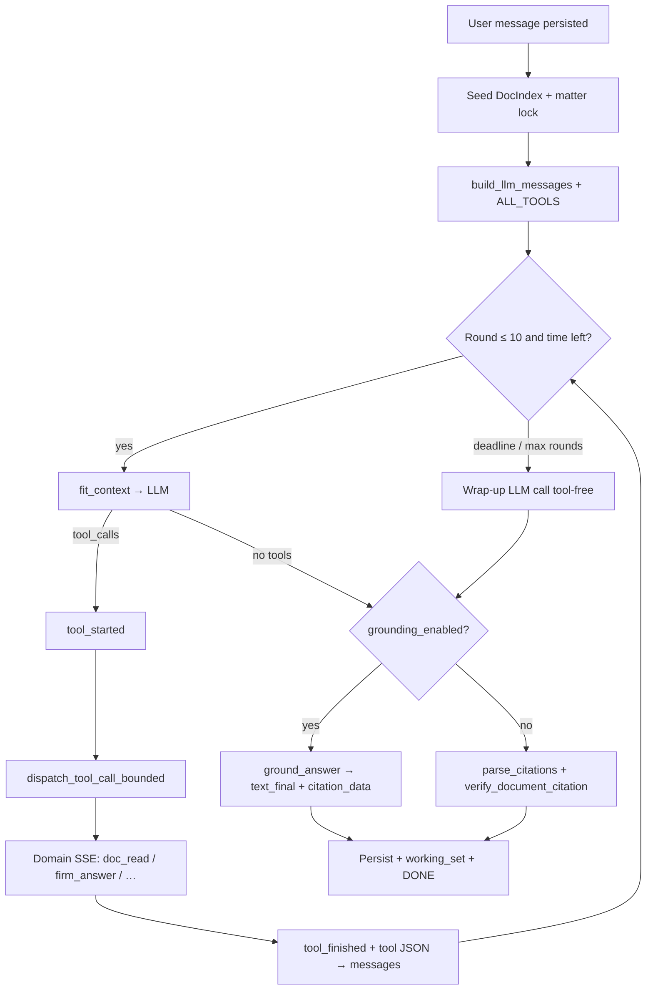

# Assistant architecture — in depth

How the **Assistant** (multi-turn tool agent) is built, how every layer connects, and how a single lawyer message becomes a grounded, cited answer with optional edits, batch review, and artifacts.

> Companion docs: high-level platform map in [`SYSTEM_ARCHITECTURE.md`](SYSTEM_ARCHITECTURE.md); Ask the Firm deep dive in [`ASK_THE_FIRM_ARCHITECTURE.md`](ASK_THE_FIRM_ARCHITECTURE.md); Ask-vs-Assistant product plan in [`plan/15_km_desk_and_assistant_scale.md`](plan/15_km_desk_and_assistant_scale.md); older Mike gap checklist in [`assistant_chatbot_deep_gap_analysis.md`](assistant_chatbot_deep_gap_analysis.md) (partially obsolete — SPA chat UI already ships).

---

## 1. What the Assistant is (and is not)

| | **Ask the Firm** | **Assistant** |
|--|------------------|---------------|
| Product job | KM desk: which matter, who, which docs, facts | Reasoning, drafting, review, long-doc work |
| UI | `/ask` → `AskPage` | `/chat` (alias `/assistant`) → `ChatPage` |
| API | `POST /api/answers` (+ `/stream`) | `POST /api/chat/sessions/{id}/messages` (SSE) |
| Loop | One pipeline: scope → evidence → one LLM answer | Multi-round **tool-calling agent** (≤ 10 rounds) |
| Persistence | Ask history (`app/km/ask_history.py`) | `chat_sessions` / `chat_messages` |
| Bridge | — | Tool `ask_firm` **calls** `ask_the_firm(...)` |

They share: ACL-before-retrieve, hybrid retrieval, Bedrock/Groq/Gemini gateway, claim grounding libraries, and the SPA shell. They are **not** the same code path.

**North star for both:** retrieve the correct institutional knowledge under permissions, then produce evidence-backed prose — not “can an LLM talk about these PDFs?”

---

## 2. Big picture — everything that touches a chat turn

```text
┌────────────────────────────────────────────────────────────────────────────┐
│  Browser SPA                                                               │
│  ChatPage · HistoryPane · MatterScopePicker · MessageParts · ReviewTable   │
│  EditProposalsCard · CitationDocumentPanel · Markdown citation pills       │
│  frontend/src/api/chat.ts  →  streamMessage() SSE client                   │
└───────────────────────────────┬────────────────────────────────────────────┘
                                │ POST /api/chat/sessions/{id}/messages
                                │ SSE: text_delta | text_final | tool_* | …
┌───────────────────────────────▼────────────────────────────────────────────┐
│  chat_router.send_message                                                  │
│  rate limit → own session → persist user msg → seed DocIndex → agent       │
│  finally: persist assistant content/events/citations (incl. Stop abort)    │
└───────────────────────────────┬────────────────────────────────────────────┘
                                │
┌───────────────────────────────▼────────────────────────────────────────────┐
│  run_chat_agent  (app/chat/agent.py)                                       │
│  system prompt + spotlight + DocIndex + history window                     │
│  LLM ↔ tools (parallel-safe reads) ↔ wrap-up ↔ grounding / cite verify     │
└───┬──────────┬──────────┬──────────┬──────────┬──────────┬─────────────────┘
    │          │          │          │          │          │
    ▼          ▼          ▼          ▼          ▼          ▼
 retrieval   app.km    documents  app.review  app.editing  grounding
 engine      Ask/desk  text/ACL   batch map   paragraph    + citations
 + passages            object     review      ops → DOCX   verify
                       store      table       redlines
```

Infrastructure (shared with the rest of the product): Postgres+pgvector, Redis, Gotenberg, object store, LLM providers. The Assistant does **not** run as a separate process.

---

## 3. End-to-end turn lifecycle

### 3.1 HTTP entry

**Router:** `app/api/routers/chat_router.py` mounted at `/api/chat`.

| Method | Path | Role |
|--------|------|------|
| `GET` | `/health` | Liveness |
| `GET` | `/models` | Active provider model |
| `GET` | `/suggestions` | Starter questions from ACL’d open matters |
| `POST` | `/sessions` | Create session (optional `matter_id`, ACL-checked) |
| `GET` | `/sessions` | List caller’s active sessions |
| `GET` | `/sessions/{id}` | Session + messages |
| `PATCH` | `/sessions/{id}` | Title / model / status / pin / matter |
| `DELETE` | `/sessions/{id}` | Soft-archive |
| `POST` | `/sessions/{id}/messages` | **Primary path — SSE agent turn** |
| `POST` | `/sessions/{id}/ask` | Sync JSON (tests / simple clients) |
| `PATCH` | `.../messages/{mid}/edits/{edit_id}` | Accept/reject one edit |
| `PATCH` | `.../messages/{mid}/edits` | Bulk accept/reject by document |
| `POST` | `.../messages/{mid}/edits/export` | Tracked-changes Word + optional new version |

### 3.2 What `send_message` does before the agent

1. **Rate limit** — `rate_limit_chat_per_minute` (default 20/min per member).
2. **Ownership** — session must belong to the resolved member.
3. **Persist user message** — content + optional file attachments.
4. **Load history** — full thread from Postgres (later windowed for the LLM).
5. **Seed retrieval** (`_search`):
   - If session has `matter_id` → `km.passages.scoped_passages` (matter-scoped).
   - Else → firm-wide `retrieval.engine.retrieve` (hybrid channels + ACL in SQL).
6. **Build `DocIndex`** — short aliases `doc-0`, `doc-1`, … from hits; merge **attachments** and **carried working-set** docs from prior turns (`_with_attachments`).
7. **Matter scope dict** — locked matter code/title for the system prompt and tools.
8. **Reserve empty assistant row** — so the UI has `assistant_message_id` immediately; filled in `finally` even if the client hits Stop.

Then the SSE generator calls `run_chat_agent(...)`.

### 3.3 Agent loop (conceptual)



Bounds (defaults in `app/config.py`):

| Knob | Default | Effect |
|------|---------|--------|
| `MAX_TOOL_ROUNDS` | 10 | Hard round cap in `agent.py` |
| `chat_turn_deadline_seconds` | 180 | Whole turn wall clock (LLM + tools) |
| `chat_wrap_up_seconds` | 60 | Forced final answer when out of rounds/time |
| `chat_tool_timeout_seconds` | 30 | Default per-tool timeout |
| `chat_find_timeout_seconds` | 10 | `find_in_document` |
| `review_tool_timeout_seconds` | 170 | Batch review |
| `chat_context_max_chars` | 200_000 | Stub oldest tool outputs via `fit_context` |
| `chat_history_max_pairs` | 10 | History window into the prompt |
| `chat_read_max_chars` | 40_000 | Single-document read budget |

**Parallelism:** In one round, if every pending call is in `PARALLEL_SAFE_TOOLS` (`read_document`, `get_outline`, `find_in_document`, `fetch_documents`, `resolve_matter`, `get_matter_profile`, `find_people`), they run on a thread pool; UI events still emit in the order the model requested. A timed-out tool name is **paused** for the rest of the turn.

**`ask_inputs`:** On success the loop stops early (`waiting_for_input`). Continuation is a **new** user message — there is no mid-turn resume protocol.

---

## 4. Prompt, context, and document addressing

### 4.1 System prompt (`app/chat/system_prompt.py`)

`build_system_prompt(mode)` assembles:

- Role and safety rules (do not invent documents/matters; ACL is already applied).
- Citation contract: prose `[N]` markers + trailing `<CITATIONS>[JSON]</CITATIONS>`.
- Editing / DOCX policy (prefer `edit_document` for multi-locus / long-doc changes).
- Work **modes**: `reason` | `research` | `review` | `cite` (UI work-mode switcher).

Matter lock (when the session is pinned): searches and firm tools are constrained; the model is told not to invent other matters.

### 4.2 Message assembly (`build_llm_messages`)

Order sent to the LLM:

1. **System** — prompt + available documents list (`doc-N` → title/id) + working-set note + matter lock.
2. **History window** — last `chat_history_max_pairs` user/assistant pairs (`select_history_messages`).
3. **Current user** — wrapped in **nonce spotlight** (`app/chat/spotlight.py`) so untrusted user/doc text cannot easily override instructions.

### 4.3 Context budget (`app/chat/context.py`)

Long threads accumulate huge tool JSON. `fit_context` stubs the oldest tool outputs once the message list exceeds `chat_context_max_chars`. Documents touched in recent turns are recorded as a **`working_set`** event (persisted, not streamed) and re-indexed / listed on the next turn so the model keeps short handles without re-reading everything.

### 4.4 Long-document navigation (`app/chat/doc_nav.py`)

Deterministic section ids from headings (or page groups when there are none). Powers:

- `get_outline` — TOC only.
- `read_document(section_id | pages | cursor)` — outline + opening slice when over budget; continue with `next_cursor`.
- `find_in_document` — Ctrl+F with true hit totals and section/page context.

Text resolution goes through ACL checks + `session_doc_cache` (process LRU keyed by member + version) so repeated reads in a turn are cheap.

---

## 5. Tool catalog — what the model can do

Schemas: `app/chat/tools/schema.py` → `ALL_TOOLS = CORE_TOOLS + WORKFLOW_TOOLS`.  
Dispatch: `dispatch_tool_call` / `dispatch_tool_call_bounded` in `agent.py`.

### 5.1 Firm / KM tools → `app/km`

| Tool | Implementation | Behavior | Typical SSE |
|------|----------------|----------|-------------|
| `ask_firm` | `firm_tools` → `ask_the_firm` | Full Ask pipeline; registers returned docs as `doc-N` | `firm_answer` |
| `resolve_matter` | resolver | Ranked matter candidates + confidence | `matter_resolution` |
| `get_matter_profile` | profiles / directory | Card, team, deadlines, docs | `matter_profile` |
| `find_people` | directory | Matter team or expertise search | `people_results` |

This is the deliberate product split: **Ask is the KM desk; Assistant calls it as a tool** when it needs institutional facts, then continues with document reads, edits, or prose.

### 5.2 Document tools → text + retrieval + ACL

| Tool | Behavior | Typical SSE |
|------|----------|-------------|
| `search_firm_records` | Hybrid retrieve or matter-scoped passages; merge into DocIndex | `search_results` |
| `read_document` | Whole if small; else outline + window | `doc_read` |
| `get_outline` | TOC only | — |
| `fetch_documents` | Batch reads under a shared char budget | multiple `doc_read` |
| `find_in_document` | In-doc search + section/page | `doc_find` |

Readable docs must pass `_readable` / ACL clauses. Text lands in `doc_store` (alias → body) for citation verify and grounding.

### 5.3 Scale review → `app/review/batch.py`

| Tool | Behavior | SSE |
|------|----------|-----|
| `review_documents` | Same questions across many docs (≤ `review_max_documents`, default 500). `mode=full` maps each doc (parallel LLM + quote locate + Redis cache). `mode=screen` ranks without full read. | `review_table` |

UI: `ReviewTableCard`. Results also feed grounding as record sources.

### 5.4 Editing → `app/editing` + export routes

| Tool / API | Behavior | SSE / outcome |
|------------|----------|---------------|
| `edit_document` | Natural-language instruction → paragraph-level ops from original DOCX (or extracted text) | `edit_proposals` (`anchoring: paragraph`) |
| `propose_edits` | Model-supplied original→proposed spans located via quote verify | `edit_proposals` |
| `PATCH .../edits` | Lawyer accept/reject | Persisted on message events |
| `POST .../edits/export` | Tracked changes into original Word; optional new document version | Downloadable draft |

Planner model: `edit_model` or fall back to the chat model.

### 5.5 Generation & UX

| Tool | Behavior | SSE |
|------|----------|-----|
| `generate_docx` / `generate_excel` | Artifact in object store + DB row + download URL | `doc_created` |
| `ask_inputs` | Structured clarifying questions; stops the turn | `ask_inputs` |
| `list_workflows` / `read_workflow` | Workflow catalog | — |

---

## 6. Citations and grounding — two paths

The system prompt always asks for `[N]` + a `<CITATIONS>` JSON block. What happens after the final LLM text depends on **`grounding_enabled`** (default **true**).

### 6.1 Grounding on (production default)

```text
Final agent text (may include <CITATIONS>)
        │
        ▼
ground_chat_text → app.grounding.ground_answer
  • Sources = doc_store passages + firm-record tool text (synthetic record:N)
  • Verifier model ≠ generator (grounding_verifier_model)
  • Unsupported claims may be removed / rewritten
        │
        ▼
SSE: reasoning ("Checking…") → grounding report → text_final → citation_data[]
```

Interim narration during tool rounds still streams as `text_delta`. The **final** answer is **not** shown as deltas when grounding is on — only `text_final` after verification. If grounding throws, the UI gets an explicit failure message rather than an unchecked answer.

### 6.2 Grounding off (classic path)

```text
parse_citations(full_text)
  → for each cite: verify_document_citation(source from doc_store)
       locate_quote: exact → whitespace/case → punctuation-tolerant
       drift auto-correction + start_char / end_char
  → attach real document_id + title from DocIndex
  → SSE citation_data; strip CITATIONS block from prose
```

Modules: `app/chat/citations.py`, `app/chat/verify_citations.py`.

### 6.3 What the lawyer sees

- Markdown answer with `[N]` pills (`Markdown.tsx`).
- Citation side panel / open-in-viewer with quote highlight (`CitationDocumentPanel`).
- Optional grounding report event for transparency / evals.

---

## 7. SSE protocol (runtime truth)

Client: `frontend/src/api/chat.ts` → `streamMessage`. Lines are `data: {json}` or `data: [DONE]`.

| Event type | When | UI use |
|------------|------|--------|
| `session_id` | Start of stream | Bind `assistant_message_id` |
| `reasoning` | Open + grounding step | Status / accordion |
| `text_delta` | Interim prose; final only if grounding off | Live markdown |
| `text_final` | Grounded answer | Replace/finalize answer |
| `tool_started` / `tool_finished` | Every tool | `StepTimeline` pills |
| `doc_read` / `doc_find` / `search_results` | Document tools | Activity detail |
| `firm_answer` / `matter_resolution` / `matter_profile` / `people_results` | KM tools | Cards / context |
| `review_table` | Batch review | `ReviewTableCard` |
| `edit_proposals` | Edit / propose | `EditProposalsCard` |
| `doc_created` | generate_* | Download card |
| `ask_inputs` | Clarification | Interactive form |
| `citation_data` | Verified quotes | Pills + panel |
| `grounding` | Claim report | Debug / trust |
| `chat_title` | First-turn title gen | History label |
| `error` | LLM failure | Toast / message |
| `stopped` | Client abort (persisted only) | Partial answer saved |
| `working_set` | End of turn (persisted, not streamed) | Next-turn carry |
| `[DONE]` | End marker | Close stream |

`models.SSEEventType` in code is a subset; treat the table above as authoritative.

**Stop button:** Aborting the fetch closes the generator; router `finally` still saves partial `full_text` + events with `stopped`.

---

## 8. Persistence model

| Store | Contents |
|-------|----------|
| `chat_sessions` | member, title, model, status, matter_id, pinned_at, timestamps |
| `chat_messages` | role, content, files, **events** (tool/edit/review/working_set), **citations**, model |
| `app/chat/store.py` | CRUD: create/list/patch/archive session; append/update messages |
| `app/chat/title_generator.py` | Auto-title after first user turn |
| `app/chat/session_doc_cache.py` | In-process text cache (not durable across restarts) |

Ask history is **separate** (`/api/answers/history`). Deep links like “Continue in the Assistant” open `/chat?matter=…&q=…` and create a **new** chat session, they do not morph an Ask row into a chat thread.

---

## 9. Frontend anatomy

| Piece | Path | Role |
|-------|------|------|
| Page | `frontend/src/pages/ChatPage.tsx` | Session chrome, composer, streaming state |
| API | `frontend/src/api/chat.ts` | Session CRUD + `streamMessage` |
| Timeline | `components/chat/MessageParts.tsx` | Steps, ask_inputs, edit cards, files |
| Review | `components/chat/ReviewTableCard.tsx` | Batch review table |
| History | `components/chat/HistoryPane.tsx` | Session list |
| Matter pin | `MatterScopePicker` | Conversation matter |
| Citations | `CitationDocumentPanel` + Markdown pills | Jump-to-quote |
| Entry | `useStartConversation` / Home / Matter / KM panel | Navigate into `/chat` |

Ask UI (`AskPage`, `AIAnswer`, `KmPanel`) is adjacent: same design language, different API.

---

## 10. How subsystems connect (dependency map)

```text
Assistant
  ├─ Identity / ACL ──── resolve_member → SQL permissions on every retrieve/read
  ├─ Retrieval ───────── seed hits; search_firm_records; same fusion policy as Ask
  ├─ KM desk ─────────── ask_firm / resolve / profile / people → app.km.*
  ├─ Passages ────────── matter-scoped seed when session.matter_id set
  ├─ Documents ───────── shared text/PDF/download paths the editor uses
  ├─ Batch review ────── app.review.batch (+ Redis cache)
  ├─ Editing ─────────── app.editing.* → accept/reject → tracked DOCX export
  ├─ Drafting ────────── generate_docx / generate_excel artifacts
  ├─ Grounding ───────── app.grounding (claim gate); verify_citations (quote gate)
  ├─ Spotlight ───────── nonce fences on user + tool document text
  ├─ Redis ───────────── rate limits; review map cache
  ├─ Object store ────── generated files; DOCX originals for edit export
  ├─ Postgres ────────── sessions, messages, firm records, chunks, ACL
  └─ LLM gateway ─────── Bedrock preferred → Gemini → Groq for chat_complete
                         separate verifier model for grounding
```

**Invariant:** restricted documents never enter the DocIndex or tool results for a member who lacks access. The model is never asked to “not mention” secrets it was given.

---

## 11. LLM and model routing

```text
Chat generation ──► Bedrock (preferred) → Gemini → Groq
Grounding ────────► grounding_verifier_model (default kimi-k2.5 on Bedrock)
Batch review map ─► review_map_model (default kimi-k2.5)
Edit planner ─────► edit_model or chat model
Embeddings ───────► MiniLM 384-d (retrieval only; not inside the agent loop)
Rerank ───────────► local CE (retrieval seed / search_firm_records)
```

Provider selection lives in `_call_llm` / Bedrock-Gemini-Groq helpers inside `agent.py`, sharing credentials with Ask via `app/llm` helpers and settings.

---

## 12. Worked example — one realistic turn

Lawyer (matter pinned to MTR-…): *“What is the Long Stop Date, and rename it to Outside Date everywhere in the SPA.”*

1. Router seeds DocIndex from matter passages (SPA likely `doc-0`).
2. Agent reasoning: mode + document count.
3. Round 1: `find_in_document(doc-0, "Long Stop Date")` and/or `read_document` on the clause section → `doc_find` / `doc_read` SSE.
4. Round 2: `edit_document(doc-0, "rename Long Stop Date to Outside Date everywhere…")` → `edit_proposals` cards.
5. Round 3: final prose with `[1]` + `<CITATIONS>` quoting the date clause.
6. Grounding checks each statement against `doc_store`; streams `text_final` + `citation_data`.
7. Lawyer accepts edits in the card → `PATCH .../edits` → `POST .../edits/export` → tracked-changes DOCX as a new version.
8. `working_set` remembers `doc-0` for follow-ups (“also update the disclosure letter”).

---

## 13. Security and reliability layers (stacked)

| Layer | Mechanism |
|-------|-----------|
| AuthN | OIDC / API key / trusted `X-Member-Id` (dev) |
| AuthZ | SQL ACL before retrieval and before every document read |
| Prompt injection | Nonce spotlight fences on user message and document text |
| Citation honesty | Quote locate + drift fix; or claim-level grounding |
| Tool runaway | Per-tool timeouts, paused tools, turn deadline, wrap-up |
| Context blow-up | `fit_context` stubbing + read budgets + working set |
| Abuse | Per-member chat rate limit |
| Abort | Stop saves partial answer; never leaves a blank reserved row forever without flush |
| Audit | `chat.prompt` / `chat.answer` with cited document ids |

---

## 14. Configuration cheat sheet

| Setting | Default | Role |
|---------|---------|------|
| `grounding_enabled` | `true` | Claim gate + `text_final` path |
| `grounding_verifier_model` | `moonshotai.kimi-k2.5` | Verifier ≠ writer |
| `grounding_verify_batch` | `6` | Parallel claim batches |
| `chat_history_max_pairs` | `10` | Prompt history |
| `chat_read_max_chars` | `40000` | Per-read budget |
| `chat_context_max_chars` | `200000` | Evict old tool JSON |
| `chat_turn_deadline_seconds` | `180` | Turn wall clock |
| `chat_wrap_up_seconds` | `60` | Forced answer |
| `chat_tool_timeout_seconds` | `30` | Default tool timeout |
| `review_concurrency` / `review_max_documents` | `24` / `500` | Batch review scale |
| `rate_limit_chat_per_minute` | `20` | Throttle |

---

## 15. File map

```text
app/api/routers/chat_router.py     # HTTP + SSE + edit accept/export
app/api/routers/answers.py         # Ask the Firm (sibling product)
app/chat/agent.py                  # Loop, dispatch, grounding exit
app/chat/system_prompt.py          # Modes + citation contract
app/chat/context.py                # fit_context, working_set
app/chat/spotlight.py              # Nonce fences
app/chat/doc_nav.py                # Outline / section / page / cursor
app/chat/citations.py              # Parse <CITATIONS>
app/chat/verify_citations.py       # 3-tier quote locate
app/chat/store.py / models.py      # Sessions + messages
app/chat/title_generator.py
app/chat/session_doc_cache.py
app/chat/tools/
  schema.py                        # ALL_TOOLS definitions
  document_tools.py                # read / find / fetch / search
  firm_tools.py                    # ask_firm + KM
  batch_tools.py                   # review_documents
  edit_tools.py                    # edit_document
  review_tools.py                  # propose_edits
  generation_tools.py              # docx / excel
app/km/*                           # Ask pipeline used as tools
app/retrieval/*                    # Seed + search_firm_records
app/review/batch.py                # Multi-doc map
app/editing/*                      # Paragraph edit engine
app/grounding/*                    # Claim verification
frontend/src/pages/ChatPage.tsx
frontend/src/api/chat.ts
frontend/src/components/chat/*
```

---

## 16. Evals and gates (how we know it works)

| Concern | Harness |
|---------|---------|
| Ask / KM desk | `evals/km_live_eval.py` |
| Claim grounding | `evals/grounding_eval.py` (+ chat timings when agent runs) |
| Batch review | `evals/batch_review_eval.py` |
| Long-doc edit | `evals/long_doc_edit_eval.py` + experiment notes |
| Agent rounds / deadlines | `tests/test_agent_rounds.py` |
| Doc nav | `tests/test_doc_nav.py` |
| Chat e2e | `frontend/e2e/` (chat, editor, privacy, …) |

Retrieval quality remains a **separate** gate (`evals/retrieval_eval.py`). A bad Assist answer that cites the wrong matter is often a retrieval/ACL/scope bug, not “the LLM forgot.”

---

## 17. Mental model to keep

1. **Ask answers firm questions once; Assistant acts over many tools and turns.**
2. **DocIndex aliases (`doc-N`) are the currency** between retrieval, tools, citations, and the UI.
3. **ACL is in SQL before ranking and before every read** — never post-hoc redaction by the model.
4. **Grounding (default) replaces raw streaming of the final answer** with a verified `text_final`.
5. **Scale features (outline reads, batch review, paragraph edits, deadlines)** exist so the agent can work across hundreds of docs and 100–400 page agreements without stuffing full text into one prompt.
6. **Everything durable for the lawyer lives on the message** (events + citations); Redis caches and process caches are accelerators only.

When extending the Assistant, add a tool schema + dispatcher branch + SSE event the SPA already understands (or a new card), keep ACL on the data path, and add an eval that fails if the behavior regresses.
