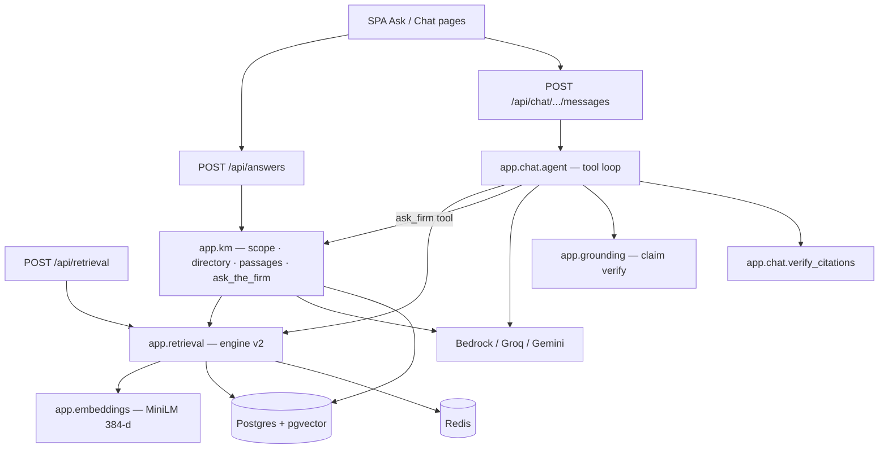

# System architecture — LEXOS / FirmOS

How the platform is split into services, how **Ask the Firm** and the **Assistant** work, and how AI connects to retrieval, documents, and the SPA.

> Live product path: `legal-memory-retrieval/` + corpus `dummy-firm/`.  
> Companion prototypes (`doc-search`, `apex-dms`) are **not** part of this runtime.

---

## 1. Big picture

This is **not** a fleet of microservices. One FastAPI process exposes many **logical services** (routers). A few **infrastructure processes** sit beside it.

```text
┌──────────────────────────────────────────────────────────────────────────┐
│  Browser SPA (Vite React → served from /ui + /static)                    │
│  Ask · Chat · Matters · Documents · Calendar · Home · …                  │
└───────────────────────────────┬──────────────────────────────────────────┘
                                │ HTTP + SSE
┌───────────────────────────────▼──────────────────────────────────────────┐
│  API process  —  uvicorn app.api.main:app  (:8000)                       │
│  Logical services: retrieval · answers · chat · documents · firm · …     │
│  In-process: MiniLM embeddings · CE rerank · ACL · Redis cache clients   │
└───┬─────────────┬─────────────┬─────────────┬──────────────┬─────────────┘
    │             │             │             │              │
    ▼             ▼             ▼             ▼              ▼
 Postgres+    Redis         Gotenberg     Object store    External LLMs
 pgvector     (cache,       (Office→PDF)  (local / S3)    (Bedrock / Groq /
 (:55432)      rate limit)   (:3000)                       Gemini)
    │
    │  (production profile)
    ▼
 Ingest worker  —  python -m app.workers.ingest
 (parse · chunk · embed · index queued uploads)
```

**North star:** given tens of thousands of documents across hundreds of matters, retrieve the **correct institutional knowledge**, honor **ACL before ranking**, and produce **evidence-backed** answers — not “can an LLM talk about these PDFs?”

---

## 2. Runtime services (processes)

| Process | Image / command | Port | Role |
|---------|-----------------|------|------|
| **API** | `uvicorn app.api.main:app` | `8000` | All HTTP/SSE; SPA; Ask; Assistant; DMS write APIs |
| **Postgres + pgvector** | `pgvector/pgvector:pg16` | `55432`→5432 | Matters, docs, chunks, vectors, ACL, chat sessions, calendar |
| **Redis** | `redis:7-alpine` | `6380`→6379 | Retrieval/embedding cache, rate limits |
| **Gotenberg** | `gotenberg/gotenberg:8` | `127.0.0.1:3000` | Office → PDF for exact document view |
| **Ingest worker** | `python -m app.workers.ingest` | — | When `INGEST_MODE=queue`: parse, chunk, embed off the API |
| **MinIO** (optional) | profile `object-store` | `9000` | S3-compatible object store |

Defined in `docker-compose.yml`. Locally you often run only Postgres + Redis via compose and the API on the host.

### What is *not* a separate service (yet)

| Concern | Where it runs |
|---------|----------------|
| Hybrid retrieval (BM25 / vector / metadata / graph) | Inside API (`app/retrieval`) |
| Cross-encoder rerank | Inside API (local MiniLM CE) |
| Query embeddings | Inside API (`app/embeddings`, MiniLM 384-d) |
| Ask the Firm | Inside API (`app/km` + `POST /api/answers`) |
| Assistant agent loop | Inside API (`app/chat` + `POST /api/chat/...`) |
| Claim grounding / citation verify | Inside API (`app/grounding`, `app/chat/verify_citations`) |

Kafka, Neo4j, OpenSearch, and a multi-agent mesh are **explicitly deferred** until metrics justify them.

---

## 3. Logical services inside the API

`app/api/main.py` mounts routers under `/api/*`. Each is a **bounded capability**, not a separate deployable.

```text
                    ┌──────────── auth / OIDC or X-Api-Key / X-Member-Id ────────────┐
                    ▼                                                                │
┌─────────┐  ┌──────────┐  ┌─────────┐  ┌──────────┐  ┌─────────┐  ┌──────────────┐ │
│ system  │  │ home     │  │ firm    │  │ documents│  │ search  │  │ editor/word  │ │
│ health  │  │ stats    │  │ matters │  │ versions │  │ browse  │  │ drafting     │ │
│ info    │  │          │  │ clients │  │ upload   │  │         │  │ review       │ │
│         │  │          │  │ people  │  │ text/PDF │  │         │  │              │ │
│         │  │          │  │ calendar│  │ ACL      │  │         │  │              │ │
└─────────┘  └──────────┘  └─────────┘  └──────────┘  └─────────┘  └──────────────┘ │
                                                                                     │
┌────────────────────────────────── AI plane ───────────────────────────────────────┐│
│  retrieval     answers (Ask)      chat (Assistant)      grounding / citations     ││
│  /api/retrieval  /api/answers       /api/chat           (shared libraries)        ││
└───────────────────────────────────────────────────────────────────────────────────┘│
                    ▲                                                                │
                    └──────── every route resolves member → ACL in SQL ──────────────┘
```

### Service catalog (high level)

| Prefix | Purpose |
|--------|---------|
| `/api/system` | Health, feature catalog, architecture doc |
| `/api/auth` | OIDC / session / API-key browser login |
| `/api/retrieval` | Hybrid retrieve (+ debug) |
| `/api/answers` | **Ask the Firm** (sync + SSE stream + history) |
| `/api/chat` | **Assistant** sessions + SSE tool loop |
| `/api/matters`, `/clients`, `/people`, `/calendar`, `/home` | Firm write/read layer |
| `/api/documents`, `/uploads`, `/editor`, `/word`, `/drafting` | Document lifecycle + Office |
| `/api/search`, `/knowledge`, `/reviews`, `/tabular` | Search / KM / review jobs |
| `/api/workflows`, `/caselaw`, `/sources`, `/access`, `/admin`, `/audit` | Adjacent capabilities (some flags off) |

`enable_legacy_projects` defaults **false** — projects/activity APIs stay unmounted unless needed.

---

## 4. Shared foundation (everything hangs off this)

### 4.1 Identity & ACL

1. Request arrives → `resolve_member` (API key, OIDC session, or trusted `X-Member-Id` in dev).
2. Every retrieval / matter / document query applies **permissions in SQL** before ranking.
3. Restricted chunks never enter the candidate set for the model to “not mention.”
4. Cache keys include member / permission / knowledge / index epochs so revocations don’t serve stale hits.

### 4.2 Data model (simplified)

```text
Client ──< Matter ──< Document ──< Version ──< Chunk (+ embedding)
              │            │
              │            └── permissions / ethical walls
              ├── team (members)
              ├── court_deadlines / calendar_events
              └── relationships (SQL graph seeds)
```

Corpus seed: `dummy-firm/data/` → ingest/embed scripts → Postgres.

### 4.3 Object storage

Binary originals (and optional PDF renditions via Gotenberg) live under `data/object_store/` (local) or S3/MinIO. Postgres holds metadata, text, chunks, and vectors.

---

## 5. AI plane — overview

There are **two user-facing AI products** plus shared retrieval and LLM gateways:

| Product | Endpoint | Style | Best for |
|---------|----------|-------|----------|
| **Ask the Firm** | `POST /api/answers` (+ `/stream`) | One-shot: gather evidence → one LLM JSON answer → citations | “What is the status of X?”, “Who is on the team?”, firm KM Q&A |
| **Assistant** | `POST /api/chat/sessions/{id}/messages` (SSE) | Multi-round **tool-use agent** | Drafting, reading long docs, review, generate files, multi-step work |
| **Retrieval only** | `POST /api/retrieval` | No answer LLM | Debug, eval, internal tools |



---

## 6. Retrieval fabric (shared by Ask, Assistant, `/api/retrieval`)

Default: **engine v2** (`USE_ENGINE_V2=true`), fusion policy `p55_repair_ce_protect`, matter scope `hard`.

```text
Query
  → understand()          # intent, ids, filters (app/query)
  → plan()                # which channels + weights (RetrievalPlan)
  → parallel channels (asyncio, ACL in SQL each):
        BM25  |  Vector (MiniLM)  |  Metadata  |  Matter  |  Graph seeds  |  …
  → dedupe + provenance on every Candidate
  → conditional graph expansion (post-pool, still ACL-aware)
  → weighted RRF fusion
  → conditional cross-encoder rerank (top ~100 → k)
  → top-k hits
```

**Eval gate:** `evals/retrieval_eval.py` vs `evals/last_retrieval_run.json`. Missing gold docs are a retrieval bug, not an LLM bug.

**Frozen / off by default (keep code, do not enable in prod without new numbers):** theme-scoped retrieval, semantic doc resolve, evidence-first C7 / CE-on-evidence, GraphRAG/Neo4j.

Key modules:

| Module | Role |
|--------|------|
| `app/retrieval/engine_v2.py` | Parallel async pipeline |
| `app/retrieval/planner.py` | Cost-aware channel plan |
| `app/retrieval/fusion_policy.py` | RRF weights + CE protection |
| `app/retrieval/reranker.py` | Cross-encoder |
| `app/embeddings/minilm.py` | Local 384-d vectors |
| `app/storage/postgres.py` | Search / vector / graph / hierarchical stores |

---

## 7. Ask the Firm architecture

**UI:** `frontend` → `AskPage` → `POST /api/answers` or `/api/answers/stream` (`frontend/src/api/ask.ts`).

**Router:** `app/api/routers/answers.py` → rate limit → `app.km.answer.ask_the_firm` / `ask_the_firm_stream`.

### 7.1 Pipeline

```text
Lawyer question (+ optional scope: {type, value})
        │
        ▼
┌───────────────────┐
│ resolve_scope     │  explicit scope / "Matter: q" prefix / inline codes
└─────────┬─────────┘
          ▼
┌───────────────────┐
│ classify intent   │  people · overview · matter list · fact lookup · …
└─────────┬─────────┘
          ▼
┌───────────────────┐
│ gather_evidence   │  no LLM yet
│  • matter cards   │  (directory — structured firm records)
│  • people rows    │
│  • passages       │  in-matter rank, or corpus retrieve() if unscoped
│  • candidates     │  nearby matters when ambiguous
└─────────┬─────────┘
          ▼
┌───────────────────┐
│ pack evidence     │  [MTR-…] [MEM-…] [DOC-…] blocks, char budget
└─────────┬─────────┘
          ▼
┌───────────────────┐
│ LLM JSON answer   │  Bedrock preferred (temp 0); validate citations ⊆ evidence
│  or fallback      │  deterministic record prose if LLM unavailable
└─────────┬─────────┘
          ▼
┌───────────────────┐
│ DMS envelope      │  key_finding, sources, structured_citations, panel, audit
└───────────────────┘
```

Core file: `app/km/answer.py` (orchestration). Supporting: `scope.py`, `intent.py`, `directory.py`, `passages.py`, `panel.py`, `evidence.py`, `resolver.py`.

### 7.2 Streaming

`POST /api/answers/stream` emits SSE:

1. `evidence` — highlighted sources  
2. `key_finding` / `delta*` — progressive answer pieces  
3. `final` — same shape as sync `POST /api/answers`  
4. `[DONE]`

### 7.3 Guarantees

- Citations must refer to ids present in packed evidence (invented ids stripped / rejected).
- Abstention paths: empty query, unresolved scope, no evidence, insufficient facts.
- History: `GET/DELETE /api/answers/history` via `app/km/ask_history.py`.

### 7.4 How Ask connects to the rest

| Dependency | Use |
|------------|-----|
| Retrieval engine | Unscoped passage search |
| Postgres directory | Matter cards, team, people, deadlines |
| Bedrock (or fallback) | Single JSON completion |
| Redis rate limit | Per-member Ask throttle |
| Audit | `ask` events with cited docs |
| SPA Home / Ask | Recent questions + answer UI (`AIAnswer`) |

---

## 8. Assistant architecture

**UI:** `ChatPage` → session CRUD + `POST /api/chat/sessions/{id}/messages` SSE (`frontend/src/api/chat.ts`).

**Router:** `app/api/routers/chat_router.py` → `run_chat_agent` in `app/chat/agent.py`.

### 8.1 Mental model

Ask is **retrieve-then-answer once**.  
Assistant is an **agent**: the model decides which tools to call (read doc, Ctrl+F in doc, ask firm, edit, generate Word/Excel, batch review, …) over multiple rounds, then streams prose + verified citations.

```text
User message
    │
    ├─ optional: seed DocIndex from hybrid retrieve() hits
    ├─ build system prompt + AVAILABLE DOCUMENTS (doc-0, doc-1, …)
    │
    ▼
┌─────────────────────────────────────────────┐
│  Agent loop (≤ MAX_TOOL_ROUNDS)             │
│    LLM (tools schema)                       │
│      ├─ tool_calls → dispatch_tool_call     │
│      │     emit SSE: doc_read, firm_answer, │
│      │     activity, ask_inputs, …          │
│      │     tool results → next LLM round    │
│      └─ final text + <CITATIONS> block      │
└──────────────────┬──────────────────────────┘
                   ▼
         verify_citations (3-tier fuzzy + drift fix)
         optional ground_answer (claim-level, other model)
                   ▼
         persist assistant message + events
         SSE text_delta / citation_data / [DONE]
```

### 8.2 Tool groups

| Group | Tools (representative) | Backed by |
|-------|------------------------|-----------|
| Documents | `read_document`, `fetch_documents`, `find_in_document`, `get_outline`, `search_firm_records` | Object store + text + ACL |
| Firm KM | `ask_firm`, `resolve_matter`, `get_matter_profile`, `find_people` | **`app.km` / Ask the Firm** |
| Edit / review | `edit_document`, `propose_edits`, `review_documents` | `app/editing`, `app/review` |
| Generation | `generate_docx`, `generate_excel` | Drafting + download links |
| UX | `ask_inputs`, workflows list/read | Mid-turn structured questions |

**Bridge:** `ask_firm` in `app/chat/tools/firm_tools.py` calls `ask_the_firm(...)`, registers returned documents into the chat-local `DocIndex` (slug `doc-N`), and returns a draft answer the agent can refine and cite with verbatim quotes.

### 8.3 SSE event types (conceptual)

| Event | Meaning |
|-------|---------|
| `text_delta` | Streamed answer tokens |
| `citation_data` | Verified quote + offsets + verification badge |
| `doc_read` / tool activity | Progress (“reading …”) |
| `firm_answer` / `matter_profile` | KM tool results |
| `ask_inputs` | Need user choice / missing doc |
| generated file events | Downloadable artifacts |
| `[DONE]` | End of turn |

### 8.4 Safety layers

| Layer | Module |
|-------|--------|
| Nonce spotlighting (tool output fencing) | `app/chat/spotlight.py` |
| Citation parse + 3-tier verify + drift correction | `app/chat/citations.py`, `verify_citations.py` |
| Claim-level grounding (verifier ≠ generator) | `app/grounding` |
| Tool wall-clock / turn deadline | config: `chat_tool_timeout_seconds`, `chat_turn_deadline_seconds` |
| Context budget | `app/chat/context.py` (`fit_context`, working set) |
| Rate limit | `rate_limit_chat_per_minute` |

### 8.5 How Assistant connects to everything

```text
Assistant
  ├─ Retrieval          → seed docs / search_firm_records
  ├─ Ask the Firm (KM)  → ask_firm / resolve_matter / profiles / people
  ├─ Documents API      → same ACL’d text the editor uses
  ├─ Editing / review   → redlines, batch map over docs
  ├─ Drafting / Word    → generated artifacts; Word add-in taskpane can call related APIs
  ├─ Matter scope       → conversation matter pins search tools
  ├─ Postgres           → chat_sessions / messages persistence
  └─ LLM gateway        → Bedrock preferred for chat_complete
```

---

## 9. LLM & embedding providers

```text
                    ┌─────────────────────┐
   Answer / Chat ──►│  Bedrock (preferred)│  AWS_BEARER_TOKEN_BEDROCK
                    │  else Groq / Gemini │
                    │  else extractive    │  (Ask path only)
                    └─────────────────────┘

   Grounding ──────► Separate Bedrock model (grounding_verifier_model)
                     so the writer does not grade its own homework

   Embeddings ─────► MiniLM all-MiniLM-L6-v2 (384-d)  ← production corpus
                     Bedrock Titan optional behind factory — do NOT point
                     live retrieval at it without schema + full re-embed

   Rerank ─────────► Local cross-encoder ms-marco-MiniLM-L-6-v2
```

Unified helpers:

- `app/llm/bedrock_client.py` — chat completions used by Ask + Assistant  
- `app/llm/model_router.py` — multi-provider gateway (Bedrock, OpenAI, Anthropic, Gemini, Groq, Ollama)  
- `app/answers/llm.py` — older Ask/generate helpers (Groq/Gemini/Bedrock/extractive)  
- `app/embeddings/factory.py` — `minilm` | `bedrock`

---

## 10. End-to-end request paths

### Ask (one shot)

```text
AskPage
  → POST /api/answers[/stream]
  → answers.ask_endpoint
  → km.ask_the_firm
       → scope + intent + directory + passages
       → retrieve() when unscoped
       → Bedrock JSON
  → format_dms_response + audit
  → AIAnswer UI (key_finding, sources, citations)
```

### Assistant (multi-turn)

```text
ChatPage
  → create/list sessions
  → POST /api/chat/sessions/{id}/messages  (Accept: text/event-stream)
  → chat_router → run_chat_agent
       → optional retrieve() to seed DocIndex
       → LLM ↔ tools (incl. ask_firm → km.ask_the_firm)
       → verify citations + optional grounding
  → SSE → MessageParts / citation pills / doc drawer
  → messages persisted on session
```

### Upload → searchable knowledge

```text
Documents UI / upload API
  → object_store + document_versions row
  → inline or queue ingest worker
  → extract text → hierarchical chunks → MiniLM embed → pgvector
  → permissions compiled
  → now visible to retrieval / Ask / Assistant tools
```

---

## 11. Frontend map

| Route (concept) | Page | Primary APIs |
|-----------------|------|--------------|
| Home | `HomePage` | `/api/home`, Ask history, chat sessions |
| Ask | `AskPage` | `/api/answers`, `/api/answers/stream`, history |
| Chat | `ChatPage` | `/api/chat/sessions…` |
| Matters / Clients / People | detail + list | `/api/matters`, `/clients`, `/people` |
| Documents / Editor | detail, editor, history | `/api/documents`, `/api/editor` |
| Calendar | `CalendarPage` | `/api/calendar`, ICS feed |
| Settings / Admin | settings, admin | auth, access, system |

Built assets land in `static/` and are served by the API under `/ui`.

---

## 12. Observability & quality

| Concern | Mechanism |
|---------|-----------|
| Request correlation | `X-Request-ID` middleware |
| Traces / latency | OpenTelemetry spans; Prometheus counters (Ask abstentions, chat tools, …) |
| Retrieval quality | `evals/retrieval_eval.py` gate |
| Answer / chat quality | Separate answer evals; citation ⊆ retrieved ids |
| Audit | `app/audit` events for Ask and sensitive writes |

---

## 13. Related docs

| Doc | Content |
|-----|---------|
| `docs/ARCHITECTURE.md` | Short retrieval-fabric summary + live endpoints |
| `docs/NORTH_STAR.md` | Product thesis + sprint gates |
| `docs/CHANGELOG.md` | Numbered experiment outcomes |
| `docs/assistant_chatbot_deep_gap_analysis.md` | Assistant parity checklist vs product research |
| `docs/plan/00_MASTER_ROADMAP.md` | Broader product roadmap |
| `.cursor/skills/legal-memory/SKILL.md` | Current retrieval freeze / flags |

---

## 14. One-sentence summary

**Postgres holds the firm’s ACL’d memory; the retrieval fabric finds passages; Ask packages structured records + passages into one cited KM answer; the Assistant is a tool-using agent that can call Ask, read/edit documents, and stream verified citations — all behind one API process, with Redis/Gotenberg/workers as supporting infrastructure and Bedrock (or fallbacks) as the only external AI dependency.**
