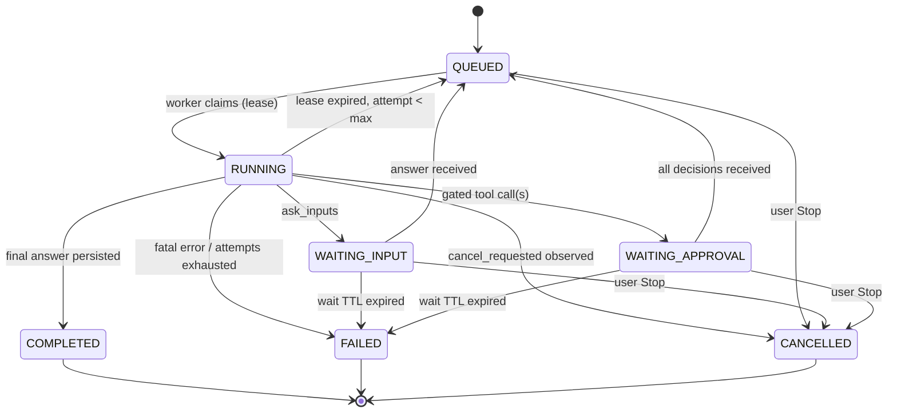

# Durable Run Runtime: design doc

Status: proposal, **Rev 2.3** · Scope: Assistant (`app/chat`) · Builds on: `ASSISTANT_ARCHITECTURE.md`

This document replaces the request-bound agent loop with a **durable, resumable, observable Run**. It covers schema, state machine, worker/lease/fencing, write-ahead tool calls, recovery-by-fold, idempotency, cancellation with side effects, event protocol, notes/evidence, plan/task, tool metadata, migration phases and the test matrix. Part II (§22) adds the legal research subsystem. Part III (§23) lists the legal work beyond research that the assistant must also cover. Appendix A logs what changed in each revision and why.

**What changed in Rev 2.3 (summary).**

1. **Delivery order (§18).** Lawyer-visible quality ships first: run + event log, then notes/evidence/plan, then research over the authorities the firm already holds. Full crash recovery and durable waits follow when long background runs need them.
2. **Research is grounded in this firm's law (§22).** The corpus holds 2,815 UN Security Council resolutions and 208 PCIJ judgments, orders and advisory opinions, all public law. The first research provider is a **local corpus provider**, not a commercial licence. Commercial providers are added per jurisdiction where the law is not public (India first, §22.15).
3. **Authority ranking is per legal system (§22.6).** International law (ICJ Statute Art. 38 sources, Art. 59 no binding precedent, Chapter VII "decides" language), India (Art. 141, APTEL over CERC/SERCs) and US common law use different models.
4. **A measurable research scorecard (§22.1)** replaces the single impressionistic score, with a target per phase.
5. **Simpler v1 recovery (§8, §9).** Checkpoints are an optimization deferred to Phase C; recovery folds the write-ahead records directly.
6. **Corrections:** raw SQL migrations (not Alembic), `update_plan`/`update_notes` are new tools, no "skills model" dependency, the existing `app/caselaw` module and `worker` process are accounted for, and the LLM provider itself is treated as an egress path.

---

## 1. Problem

Today a turn is one HTTP request: `send_message` → SSE generator → `run_chat_agent`. Consequences:

| Limitation | Cause |
|---|---|
| Hard 180 s / 10-round ceiling | Work is bound to the request process |
| Browser disconnect = awkward Stop path | SSE generator *is* the executor |
| Worker crash = lost turn | No persisted execution state |
| `ask_inputs` ends the turn; answer = new message | No resume protocol |
| Old tool output is stubbed by `fit_context` and findings are lost | No durable semantic state |
| Retrieval seeded from the raw user string | Seed happens in the router before the agent has context |
| `session_doc_cache` inconsistent across workers | Per-process LRU |

## 2. Goals and non-goals

**Goals**

1. A turn is a **Run** owned by a worker, not by a browser connection.
2. Crash, disconnect, timeout and human waits are all **resumable** from persisted state.
3. Mutating tool calls are **never duplicated** by recovery, and an unverifiable effect surfaces as an explicit `unknown`.
4. The UI consumes an **append-only event log** with replay (`Last-Event-ID`).
5. Interactive and background work share **one runtime**.
6. Zero change to prompts, retrieval, grounding, DocIndex or tool semantics in Phase A.

**Non-goals (v1)**

Separate planner/executor/evaluator models, a task-classifier LLM call, Matter Graph, Evidence Graph, Monitors, client Portal, sub-agent orchestration, manual pause/resume, multiple concurrent runs per session (designed for, not built), an owned legal corpus or citator (Part II integrates licensed ones).

## 3. Principles

1. **The worker never knows whether a browser is connected.**
2. **Every state write is fenced** by the lease epoch, so a zombie worker cannot corrupt state.
3. **Write-ahead the model's decision** (assistant message + tool calls) before executing anything.
4. **State is a fold over write-ahead records.** Checkpoints are snapshots of that fold, never a second source of truth.
5. **Effects are idempotent at the target**, not just "keyed". Fencing protects the database, not the outside world.
6. **Notes may only cite evidence the system created** from a located source span.
7. **ACL is re-evaluated on every claim, every document read and every evidence read.** Nothing is cached across a pause.
8. **The event log is the source of truth.** Pub/sub only wakes readers; a missed wake-up costs latency, never correctness.
9. **One place owns state transitions.** Worker, sweeper and API all go through the same transition module.
10. **Events are the UI contract.** Reuse existing SSE event types; add new ones.

---

## 4. Concepts

| Concept | Meaning |
|---|---|
| **Run** | One execution of the agent for one user message (or continuation) |
| **Turn / round** | One LLM call inside a run plus its tool calls, indexed by `round` |
| **Event** | Immutable, sequenced record of something the UI can render |
| **Checkpoint** | Snapshot of *derived* state after a completed round (no messages) |
| **Tool call** | A persisted, individually tracked invocation with a stable `call_id` |
| **Span handle** | Deterministic reference to a source passage returned by a tool: `(call_id, index)` |
| **Evidence** | System-created, ACL-guarded pointer to a verified quote in a source |
| **Note** | Compact finding/decision/hypothesis the agent writes; factual notes must cite evidence |
| **Task** | Goal/scope/deliverable/expected duration the model declares in `update_plan` |
| **Session context** | Small cross-run state: matter lock, active docs, resolved entities, constraints |
| **Lane** | `interactive` (priority, tight budget) or `background` (long budget) |
| **`lease_epoch`** | Fencing token, bumped on every claim and every release/requeue |
| **`attempt`** | Crash-recovery counter, bumped **only** when an expired run is requeued |

---

## 5. State machine and the transition module



Promotion from interactive to background is **not** a state: it is an in-place lane change by the lease holder (§12).

Transition table (authoritative):

| From | To | Trigger | Side effects |
|---|---|---|---|
| QUEUED | RUNNING | worker claim | `lease_owner` set, `lease_epoch += 1`; `run_resumed` event (with `reason`: `crash_recovery` \| `input` \| `approval`) unless it is the first claim |
| RUNNING | QUEUED | sweeper: lease expired and `attempt < max_attempts` | lease cleared, `lease_epoch += 1`, **`attempt += 1`**, `run_status` event |
| RUNNING | FAILED | fatal error, or lease expired and `attempt >= max_attempts` | `error` event, partial answer projected |
| RUNNING | WAITING_INPUT | `ask_inputs` | `input_requested`, `pending` set, `wait_expires_at`, lease released, `lease_epoch += 1` |
| RUNNING | WAITING_APPROVAL | one or more gated calls in the round | `approval_requested` (all gated calls), lease released, `lease_epoch += 1` |
| WAITING_INPUT | QUEUED | input endpoint | `input_provided`, answer stored as the `ask_inputs` call's result, `pending` cleared |
| WAITING_APPROVAL | QUEUED | last outstanding decision received | `approval_decided` events, decisions stored on the calls |
| WAITING_* | FAILED | `wait_expires_at` passed | `error` (reason `wait_expired`), partial projected |
| any non-terminal | CANCELLED | Stop | `stopped`, partial projected (see §14 for in-flight effects) |
| RUNNING | COMPLETED | grounding done | `grounding`, `text_final`, `citation_data`, projection, `[DONE]` |

Rules:

- Waiting for input or approval **never consumes `attempt`**. Only crash recovery does.
- Any transition out of RUNNING bumps `lease_epoch`, which invalidates the previous holder.
- A rejected approval is not a failure: the rejection becomes the tool result and the model adapts.

**Transition module (single authority).** Worker, sweeper and API endpoints call one function; nothing else writes `runs.status`:

```python
def transition(run_id, *, fence=None, from_states, to_state, patch=None,
               events=(), reason=None, project=False):
    with tx():
        row = select_for_update(run_id)
        assert row.status in from_states
        if fence: assert (row.lease_owner, row.lease_epoch) == fence   # worker-initiated
        apply(row, patch, to_state)
        if row.status == "RUNNING" and to_state != "RUNNING":
            row.lease_epoch += 1; row.lease_owner = None
        seqs = allocate_seq(row, len(events))                          # same txn
        insert_events(run_id, seqs, events)
        if to_state in TERMINAL or project:
            project_to_chat_message(row)                               # idempotent, keyed by run_id
```

The sweeper is just a loop that finds expired rows `FOR UPDATE SKIP LOCKED` and calls `transition`. There is no `REQUEUEING` state: a single transaction makes the change atomic.

---

## 6. Schema

```sql
-- ─────────── runs ───────────
CREATE TABLE runs (
  id               uuid PRIMARY KEY DEFAULT gen_random_uuid(),
  session_id       uuid NOT NULL REFERENCES chat_sessions(id),
  user_message_id  uuid NOT NULL REFERENCES chat_messages(id),
  message_id       uuid NOT NULL REFERENCES chat_messages(id),   -- reserved assistant row
  member_id        uuid NOT NULL,
  matter_id        uuid,
  parent_run_id    uuid REFERENCES runs(id),                     -- continuation of an earlier run
  status           text NOT NULL CHECK (status IN
    ('QUEUED','RUNNING','WAITING_INPUT','WAITING_APPROVAL',
     'COMPLETED','FAILED','CANCELLED')),
  lane             text NOT NULL DEFAULT 'interactive' CHECK (lane IN ('interactive','background')),
  mode             text NOT NULL DEFAULT 'reason',               -- reason|research|review|cite
  input            jsonb NOT NULL,        -- snapshot, see §7.1
  budget           jsonb NOT NULL,        -- {max_rounds,max_tokens,max_cost,deadline_at}
  usage            jsonb NOT NULL DEFAULT '{}',
  plan             jsonb,                 -- latest update_plan steps
  task             jsonb,                 -- declared via update_plan, see §10.3
  pending          jsonb,                 -- ask_inputs form or approval requests
  wait_expires_at  timestamptz,
  cancel_requested boolean NOT NULL DEFAULT false,
  lease_owner      text,
  lease_expires_at timestamptz,
  lease_epoch      bigint NOT NULL DEFAULT 0,   -- fencing token
  attempt          int NOT NULL DEFAULT 1,      -- recovery attempt, bumped only by crash recovery
  max_attempts     int NOT NULL DEFAULT 3,
  fold_version     int NOT NULL DEFAULT 1,      -- fold_round() version this run was created with; recovery uses the same one
  last_seq         bigint NOT NULL DEFAULT 0,   -- event sequence allocator
  error            jsonb,
  created_at       timestamptz NOT NULL DEFAULT now(),
  started_at       timestamptz,
  finished_at      timestamptz,
  updated_at       timestamptz NOT NULL DEFAULT now()
);

-- v1: one active run per session. To allow background runs alongside one
-- interactive run later, add `AND lane = 'interactive'` to the predicate (see §20).
CREATE UNIQUE INDEX runs_one_active_per_session ON runs(session_id)
  WHERE status IN ('QUEUED','RUNNING','WAITING_INPUT','WAITING_APPROVAL');
CREATE INDEX runs_claim ON runs(lane, created_at) WHERE status = 'QUEUED';
CREATE INDEX runs_lease ON runs(lease_expires_at) WHERE status = 'RUNNING';
CREATE INDEX runs_wait  ON runs(wait_expires_at)
  WHERE status IN ('WAITING_INPUT','WAITING_APPROVAL');

-- ─────────── event log ───────────
CREATE TABLE run_events (
  run_id     uuid NOT NULL REFERENCES runs(id),
  seq        bigint NOT NULL,
  type       text NOT NULL,
  payload    jsonb NOT NULL,
  created_at timestamptz NOT NULL DEFAULT now(),
  PRIMARY KEY (run_id, seq)
);

-- ─────────── write-ahead model turns ───────────
CREATE TABLE run_turns (
  run_id            uuid NOT NULL REFERENCES runs(id),
  round             int  NOT NULL,
  kind              text NOT NULL DEFAULT 'turn' CHECK (kind IN ('turn','wrap_up')),
  assistant_message jsonb NOT NULL,   -- text + tool_calls with fixed call_ids
  usage             jsonb,
  attempt           int NOT NULL,
  created_at        timestamptz NOT NULL DEFAULT now(),
  PRIMARY KEY (run_id, round)
);

-- ─────────── tool calls ───────────
CREATE TABLE run_tool_calls (
  id              uuid PRIMARY KEY,                  -- call_id, assigned when the turn is persisted
  run_id          uuid NOT NULL REFERENCES runs(id),
  round           int  NOT NULL,
  idx             int  NOT NULL,
  name            text NOT NULL,
  args            jsonb NOT NULL,
  args_hash       text NOT NULL,                     -- sha256 of canonical args; approvals bind to this
  risk            text NOT NULL,                     -- read|draft|mutate|external_send|control
  status          text NOT NULL CHECK (status IN
    ('planned','awaiting_approval','approved','rejected',
     'started','succeeded','failed','unknown','cancelled')),
  idempotency_key text NOT NULL,                     -- f(run_id, call_id)
  approved_by     uuid,
  approved_at     timestamptz,
  decision_reason text,
  result          jsonb,                             -- small results inline (includes spans, new aliases)
  result_ref      text,                              -- object-store key for large results
  effect_ref      text,                              -- artifact / version / export id for verification
  error           jsonb,
  attempt         int,
  started_at      timestamptz,
  finished_at     timestamptz,
  UNIQUE (run_id, round, idx)
);

-- ─────────── checkpoints (derived state only) ── DEFERRED to Phase C+ (§9) ───────────
-- v1 recovery folds run_turns + run_tool_calls from round 0 (≤ 40 rounds).
-- Add this table only when fold time on resume is measured as a problem.
CREATE TABLE run_checkpoints (
  run_id     uuid NOT NULL REFERENCES runs(id),
  round      int  NOT NULL,
  state      jsonb NOT NULL,   -- see §9
  created_at timestamptz NOT NULL DEFAULT now(),
  PRIMARY KEY (run_id, round)
);

-- ─────────── evidence & notes ───────────
CREATE TABLE evidence (
  id              uuid PRIMARY KEY DEFAULT gen_random_uuid(),
  run_id          uuid NOT NULL REFERENCES runs(id),
  type            text NOT NULL CHECK (type IN ('document','authority','email','record')),
  source_id       text NOT NULL,          -- document_id / authority id / email id
  source_version  text,                   -- document version or content hash
  locator         jsonb NOT NULL,         -- {page, section, start_char, end_char}
  quote           text,                   -- copied from SOURCE text at located offsets; NULL once purged
  quote_hash      text NOT NULL,
  tool_call_id    uuid REFERENCES run_tool_calls(id),
  purged_at       timestamptz,
  created_at      timestamptz NOT NULL DEFAULT now(),
  UNIQUE (run_id, source_id, source_version, quote_hash)
);

CREATE TABLE run_notes (
  id           uuid PRIMARY KEY DEFAULT gen_random_uuid(),
  run_id       uuid NOT NULL REFERENCES runs(id),
  round        int  NOT NULL,
  kind         text NOT NULL CHECK (kind IN ('finding','decision','hypothesis','open_question')),
  text         text NOT NULL,
  evidence_ids uuid[] NOT NULL DEFAULT '{}',
  tool_call_id uuid REFERENCES run_tool_calls(id),   -- the update_notes call that wrote it
  idx          int NOT NULL DEFAULT 0,
  created_at   timestamptz NOT NULL DEFAULT now(),
  CHECK (kind NOT IN ('finding','decision') OR cardinality(evidence_ids) >= 1),
  UNIQUE (tool_call_id, idx)             -- replay-safe: re-running update_notes cannot duplicate
);

-- ─────────── session context (cross-run) ───────────
CREATE TABLE session_context (
  session_id         uuid PRIMARY KEY REFERENCES chat_sessions(id),
  matter_id          uuid,
  resolved_entities  jsonb NOT NULL DEFAULT '{}',   -- {"that agreement": doc_id, ...}
  active_documents   jsonb NOT NULL DEFAULT '[]',   -- superset of today's working_set
  constraints        jsonb NOT NULL DEFAULT '[]',   -- [{id, text, superseded_by}]
  version            int NOT NULL DEFAULT 0,
  updated_by_run     uuid,
  updated_at         timestamptz NOT NULL DEFAULT now()
);
```

Notes on the schema:

- **`lease_epoch` vs `attempt`.** The earlier draft used one counter for both. Because it was bumped on every claim, a run that legitimately waited for input or approval three times would have exhausted `max_attempts = 3` and failed. They are now separate: `lease_epoch` fences, `attempt` counts crash recoveries only.
- **Tool call status lifecycle:** `planned` → (`awaiting_approval` → `approved` | `rejected`) → `started` → `succeeded` | `failed` | `unknown`. `cancelled` is for calls that never started or were aborted. `approved` means *authorized but not yet started*. It is a real, observable state because a run may sit in QUEUED between approval and execution.
- `run_notes` cannot be `finding`/`decision` without evidence, enforced in the database.
- `evidence` rows are created **only** by system code, and `quote` is copied from the **source text** at the located offsets, never from the model's string.
- `session_context` replaces a per-run context table and subsumes today's `working_set` event.
- **Migrations are raw SQL** files in `app/db/migrations/` (naming `YYYYMMDDx_name.sql`), applied by `scripts/migrate.py`. There is no Alembic in this repo.

---

## 7. Run lifecycle

### 7.1 Creation (API process)

`POST /api/chat/sessions/{id}/messages` (same path and SSE contract as today):

1. Rate limit, ownership check, persist user message (as today).
2. Reserve the assistant row (as today).
3. Run the retrieval seed (`_search`) and build the initial DocIndex **now**, then snapshot into `runs.input`:

```jsonc
{
  "user_text": "...",
  "attachments": [...],
  "history_message_ids": [...],          // window already selected
  "matter_scope": {"id": "...", "code": "MTR-…", "title": "…"},
  "seed_hits": [...],                    // passages/docs with scores
  "doc_index": {"doc-0": {"document_id": "...", "version": "...", "title": "..."}},
  "session_context_version": 7,
  "mode": "reason"
}
```

4. Insert the `runs` row as `QUEUED`. The partial unique index gives a clean `409` (with the active `run_id`) if the session already has an active run.
5. Open an SSE tail of the new run and return it.

Snapshotting makes resumed and retried runs deterministic. Retrieval is **not** re-seeded on resume.

### 7.2 Claim (worker)

```sql
UPDATE runs SET
  status = 'RUNNING',
  lease_owner = $worker,
  lease_expires_at = now() + interval '30 seconds',
  lease_epoch = lease_epoch + 1,
  started_at = COALESCE(started_at, now()),
  updated_at = now()
WHERE id = (
  SELECT id FROM runs
  WHERE status = 'QUEUED'
  ORDER BY (lane = 'interactive') DESC, created_at
  FOR UPDATE SKIP LOCKED
  LIMIT 1
)
RETURNING *;
```

The worker's fence is `(lease_owner, lease_epoch)` as returned. Identity is re-resolved on every claim (§15). Lease expiry always uses **database time** (`now()`), never worker clocks.

**Sweeper** (every ~10 s, inside the transition module):

```python
for run in select_expired_running(limit=50, skip_locked=True):
    if run.attempt < run.max_attempts:
        transition(run.id, from_states=["RUNNING"], to_state="QUEUED",
                   patch={"attempt": run.attempt + 1},
                   events=[run_status("requeued", reason="lease_expired")])
    else:
        transition(run.id, from_states=["RUNNING"], to_state="FAILED",
                   patch={"error": {"code": "attempts_exhausted"}},
                   events=[error("attempts_exhausted")], project=True)
for run in select_expired_waits(limit=50, skip_locked=True):
    transition(run.id, from_states=["WAITING_INPUT","WAITING_APPROVAL"], to_state="FAILED",
               patch={"error": {"code": "wait_expired"}}, events=[error("wait_expired")], project=True)
```

The `lease_epoch` bump inside `transition` guarantees a stalled original holder can no longer write.

### 7.3 Fencing

Every worker write carries `(run_id, lease_owner, lease_epoch)`:

```sql
-- heartbeat
UPDATE runs SET lease_expires_at = now() + interval '30 seconds'
WHERE id = $1 AND lease_owner = $2 AND lease_epoch = $3 AND status = 'RUNNING';

-- allocate sequence numbers atomically with the fence check
UPDATE runs SET last_seq = last_seq + $n, updated_at = now()
WHERE id = $1 AND lease_owner = $2 AND lease_epoch = $3 AND status = 'RUNNING'
RETURNING last_seq;
```

Zero rows means the lease is lost. The worker must **stop immediately**: abort the in-flight LLM stream, signal tool cancellation, write nothing more. Events, turns, tool-call rows, checkpoints, evidence and notes are all inserted inside the same transaction as the fence update.

Additional rules:

- **Heartbeat runs on an independent thread/task.** Tool timeouts (up to 170 s for batch review) far exceed the 30 s lease, so a blocked tool must never starve the heartbeat. Two missed heartbeats set a `lease_lost` flag that the loop and all tool wait loops observe.
- **Fencing protects the database, not the outside world.** A zombie mid-effect can still complete an external effect. That is covered by target idempotency (§8.4). What fencing does guarantee: the `started` mark is a fenced write, so a zombie can never *begin* a new effect after losing the lease.
- **Single-writer ordering.** Only the lease holder (or the transition module for a released run) appends events, so `seq` commits in order and readers never see a later `seq` before an earlier one.

### 7.4 Worker loop

```python
def work(run, fence):
    state, pending_turn = recover(run, fence)          # §8.2, may need no LLM call
    rnd = state.next_round
    while True:
        fence.check()
        if pending_turn is None:
            if cancel_requested(run):            return finish(CANCELLED)
            if over_budget(run, state):
                if can_promote(run, state):      promote(run, fence)          # §12
                else:                            state.wrap_up = True
            turn = llm(view_for_llm(state),                                   # eviction is a VIEW
                       tools=None if state.wrap_up else visible_tools(run))
            persist_turn(run, fence, rnd, turn)                               # WRITE-AHEAD
        else:
            turn, pending_turn = pending_turn, None                           # recovered, LLM NOT called

        if not turn.tool_calls:
            break                                                             # final-answer candidate

        outcome = execute_calls(run, fence, rnd)                              # §8.3
        if outcome.waiting:
            return release_and_wait(run, fence, outcome)

        state = fold_round(state, rnd)                                        # pure fold
        checkpoint(run, fence, rnd, state)
        rnd += 1

    final = ground(state, turn)                                               # idempotent, no external effects
    commit_completion(run, fence, final)                                      # one transition() txn
```

`execute_calls` preserves current semantics: parallel only when every pending call is `parallel_safe`, UI events in model order, per-tool timeouts, paused tool names.

---

## 8. Write-ahead turns, recovery and idempotency

### 8.1 Write-ahead

If a worker dies mid-round and resume simply re-calls the LLM, the model may emit **different** tool calls, so idempotency keys no longer line up. So:

```
llm response ─► persist run_turns + run_tool_calls(status=planned, call_ids fixed)
            ─► execute ─► persist results (with their events) ─► checkpoint
```

Text deltas stream live during generation, tagged `{round, attempt}`. A turn is only authoritative once `run_turns` has it.

### 8.2 State is a fold; the recovery algorithm

`state = fold(run_turns, run_tool_calls, run_notes, plan)` is a **pure function** of persisted records. Messages are never checkpointed. Tool outputs are referenced (`result` / `result_ref`), and `fit_context` eviction is a **view** computed per LLM call, never baked into stored state. Tool results record the DocIndex aliases they allocated, so alias allocation is replayable.

In v1 there are no checkpoints, so `latest_checkpoint` always returns `None` and recovery folds from round 0. Runs are bounded at 40 rounds, so this costs a few small queries. The checkpoint branch below is kept so Phase C can add checkpoints without changing the algorithm.

```python
def recover(run, fence):
    cp = latest_checkpoint(run)                       # None in v1 (checkpoints deferred)
    state = cp.state if cp else initial_state(run.input, session_context)
    start = cp.round + 1 if cp else 0

    for turn in persisted_turns(run, from_round=start):          # ascending
        calls = tool_calls(run, turn.round)

        if not calls:                                  # persisted turn with no tool calls
            return state, turn                         # terminal candidate: ground it, DO NOT call LLM

        todo = []
        for call in calls:                             # by idx
            if call.status in TERMINAL_CALL_STATES:    # succeeded|failed|rejected|cancelled|unknown
                continue                               # result already persisted
            if call.status == "awaiting_approval":
                return park_waiting_approval(run, fence)            # worker died before transitioning
            if call.status in ("planned", "approved"):
                todo.append(call)
            if call.status == "started":
                todo.append(resolve_started(call))     # §8.4: rerun | adopt effect | mark unknown
        if todo:
            outcome = execute_calls(run, fence, turn.round, only=todo)
            if outcome.waiting:
                return park(outcome)

        state = fold_round(state, turn.round)          # rebuild state_after_round WITHOUT the model
        checkpoint(run, fence, turn.round, state)
    return state, None                                 # next step: ask the model for the next turn
```

This closes three crash windows that an "execute the non-terminal calls" rule alone misses:

| Crash point | Recovery |
|---|---|
| Turn persisted, all tools terminal, **no checkpoint** | Fold the persisted results into state, checkpoint, continue. No LLM call |
| Turn persisted with **zero tool calls** (final candidate) | Ground the persisted text. No LLM call. Grounding is idempotent: it only produces events and `commit_completion` |
| Crash mid-generation, no turn persisted | Re-call the LLM. Clients discard unfinished `text_delta`s from earlier attempts on `run_resumed` |

A wrap-up turn is stored like any other turn with `kind = 'wrap_up'`.

### 8.3 Tool call execution

```python
def execute_calls(run, fence, rnd, only=None):
    calls = only or planned_calls(run, rnd)
    gated = [c for c in calls if policy.needs_approval(c)]
    free  = [c for c in calls if c not in gated]

    for call in free:                                  # ungated calls run first (independent by construction)
        fence.check()
        mark(call, "started")                          # FENCED write, committed before any effect
        result = execute_tool(call, idempotency_key=call.idempotency_key, cancel=token)
        persist_result(call, result)                   # status + result + its UI events, one txn

    if gated:                                          # one request for ALL gated calls in the round
        for c in gated: mark(c, "awaiting_approval")
        return Outcome(waiting="approval", calls=gated)
    return Outcome(waiting=None)
```

- **Approval binds to `args_hash`.** The request shows the exact args and hash. The approval endpoint requires the client to echo `args_hash`. At execution time the worker recomputes the hash, **re-runs policy**, and re-checks that referenced sources (e.g. document version) have not changed. A mismatch invalidates the approval and re-requests it (`approval_stale` event).
- **`tool_started` is emitted once per call**, in the same transaction as `mark(started)`. Recovery of a `started` call emits `tool_retry {call_id, attempt}` instead, so the UI timeline never shows duplicate steps.
- Result events (`doc_read`, `review_table`, `edit_proposals`, ...) are emitted **with `persist_result`**, not while the tool runs. A tool that crashes before persisting emits nothing, and the rerun emits exactly once.
- `update_notes` and `update_plan` are ordinary calls. Notes are keyed `(tool_call_id, idx)`, so replay cannot duplicate them.

### 8.4 Recovery of a call found in `started`

A crash can happen after the effect but before the result row. Each tool declares a **recovery strategy**:

| Strategy | Used by | Behavior |
|---|---|---|
| `rerun` | `read_document`, `get_outline`, `find_in_document`, `fetch_documents`, `search_firm_records`, `resolve_matter`, `get_matter_profile`, `find_people`, `ask_firm`, `review_documents`, `edit_document`, `propose_edits`, `update_plan`, `update_notes` | Safe to execute again |
| `verify` | `generate_docx`, `generate_excel`, edit export, future `create_task` | Look up `effect_ref` by deterministic key. If the effect exists, adopt it as the result. Otherwise rerun |
| `manual` | future `send_email`, external mutations | Mark `unknown`. Return the model a tool result "outcome unknown, confirm with the user" and surface a confirm prompt |

Effects must be idempotent at the target:

| Tool | Mechanism |
|---|---|
| `generate_docx` / `generate_excel` | Object key derived from `(run_id, call_id)` plus unique constraint on the artifact row |
| Edit export / new document version | Unique `(message_id, export_hash)` on the version row |
| `edit_document`, `propose_edits` | Produce proposals only (no mutation) |
| External send (future) | Provider idempotency key, or outbox table with unique `(run_id, call_id)` |

### 8.5 Fixed rules

- A run resumes from the **latest checkpoint + fold of later persisted records**.
- Test invariant: `fold(all records) == checkpoint.state + fold(later records)` at every round.
- **The LLM is never called again merely because a checkpoint is missing.** It is called only when the latest persisted turn is fully folded and no final candidate exists.
- **A recovery attempt creates no new logical turn or tool call.** `(run_id, round, call_id)` are identical across `attempt` and `lease_epoch` changes; `attempt` on a turn or call row only records which recovery attempt wrote it.
- **Fold versioning.** `fold_round()` is versioned (`runs.fold_version`, mirrored in each checkpoint). A run recovers with the fold version it was created with, so changing fold logic later never silently reconstructs old runs differently. A new version applies only to new runs, and any change to fold code requires a replay test against stored runs of the previous version.
- Doc text is **not** persisted in run state. It is rehydrated through the normal ACL-checked read path (`session_doc_cache`, moved to Redis keyed by member + version). That text is client-confidential: Redis values are **encrypted** with the same key material as stored documents (`app/sources/crypto.py`), carry a short TTL (default 30 min), and are dropped when `acl_epoch()` changes.
- DocIndex aliases are **append-only**. `doc-N` is never renumbered, so earlier citations stay valid.

---

## 9. Checkpoint format (derived state only): deferred to Phase C+

Not built in v1 (see §6, §8.2). The format below is fixed now so it can be added later without a redesign. Until then, the fold-consistency tests (19.20, 19.32) run against "fold from round 0" only.

```jsonc
{
  "round": 4,
  "attempt": 2,
  "fold_version": 1,
  "doc_index": {"doc-0": {...}, "doc-1": {...}},   // append-only
  "revoked_aliases": [],
  "plan": { "steps": [ ... ] },
  "task": { ... },
  "notes_cursor": "uuid",              // last run_notes.id included in the notes block
  "usage": {"rounds": 4, "tokens": 81234, "cost_usd": 0.42},
  "matter_scope": {...},
  "session_context_version": 7
}
```

- **No messages.** They are rebuilt from `run_turns` + `run_tool_calls`, so checkpoints stay small and there is exactly one source of truth.
- Keep the **last 3** checkpoints per run. Delete 7 days after the run finishes.
- Tool results above ~32 KB go to the object store; `result_ref` holds the key.
- The always-in-context **notes block** is rebuilt from `run_notes` on every LLM call, so eviction of old tool output never destroys findings.

---

## 10. Notes, evidence, plan/task, session context

### 10.1 Span handles and evidence

The model needs a *handle* to cite, and the system must avoid creating a row for every passage it reads. So:

1. Tools that return source passages (`read_document`, `find_in_document`, `fetch_documents`, `search_firm_records`, `ask_firm`, `review_documents` cells) annotate each returned passage with a **span handle** `(call_id, index)`, resolved from that call's persisted `result.spans[index]` (doc, version, offsets, page/section). No table; deterministic; replay-safe.
2. `update_notes` accepts evidence as `span_handle | evidence_id | {doc, quote}`. On write the system:
   - resolves the span (or locates `{doc, quote}` via `locate_quote`),
   - re-checks **ACL** and that the **source version** still matches,
   - copies the quote from the **source text** at the located offsets (never the model's string),
   - **upserts** the `evidence` row (idempotent via the unique key) and attaches the `evidence_id`.
3. Unknown handles, unlocatable quotes, inaccessible sources → the note is rejected with a tool error.

Evidence is therefore created **when first used**, not eagerly for every read passage. The final-answer grounding path upserts evidence for located quotes too, so notes and citations share provenance.

### 10.2 `update_notes`

```jsonc
{ "notes": [
  {"kind": "finding", "text": "SPA §8.2 permits termination after 30 June 2027", "evidence": ["c7f2a1.3"]},
  {"kind": "hypothesis", "text": "Side letter may override §8.2"},
  {"kind": "open_question", "text": "Which SPA version governs?"}
]}
```

- `finding`/`decision` require evidence (DB check plus validator).
- `hypothesis`/`open_question` are labeled ungrounded in the prompt block and may not appear as facts in the final answer.
- **Grounding integration:** `ground_answer` receives notes plus evidence as additional sources. A claim resting on a hypothesis is flagged or removed.
- Notes whose evidence the member can no longer access are omitted from the notes block (§15).

### 10.3 `update_plan` and the declared task

```jsonc
{ "task": {
    "type": "batch_review",              // lookup | analysis | batch_review | research | drafting | other
    "goal": "Compare 300 NDAs against the firm playbook",
    "scope": "matter MTR-123, all NDAs",
    "deliverable": "review_table",
    "success_criteria": ["every document evaluated", "deviations cited"],
    "expected_duration": "long"          // short | medium | long
  },
  "steps": [
    {"id": "s1", "title": "Find termination provisions", "status": "completed"},
    {"id": "s2", "title": "Compare with side letter", "status": "running"},
    {"id": "s3", "title": "Draft summary", "status": "pending"}
  ]
}
```

- Stored on `runs.plan` and `runs.task`, emitted as `plan_updated`. Statuses: `pending | running | completed | blocked`.
- **No classifier call.** The model declares the task in its first `update_plan`, at no extra latency. The declaration drives promotion eligibility (§12), tool visibility hints, completion review in evals, and the UI header.
- Lawyer edits to the plan arrive as a message/input event and are injected as a constraint.

### 10.4 Session context and conflicts

`session_context` is loaded at run start and updated on completion. Runs write **deltas**, not whole documents:

```jsonc
{ "add_active_documents": [...],
  "set_entities": {"the disclosure letter": "doc-uuid"},
  "add_constraints": [{"id": "c9", "text": "use v3 of the SPA"}],
  "supersede_constraints": [{"id": "c4", "by": "c9"}] }
```

```sql
UPDATE session_context SET ..., version = version + 1
WHERE session_id = $1 AND version = $expected;     -- 0 rows → re-read, re-apply delta
```

Merge rules on conflict: `active_documents` union; `resolved_entities` per-key last writer with timestamp; `constraints` **append-only with explicit supersession**, so "use v3" is never silently overwritten by "use v2". Two conflicting supersessions of the same constraint surface a `context_conflict` event. With one active run per session this is rare in v1, but the rules are fixed now so concurrent runs can be enabled later safely.

---

## 11. Tool metadata and policy

Replace bare schemas with a registry entry per tool:

```yaml
name: generate_docx
schema: {...}
risk: mutate            # read | draft | mutate | external_send | control
timeout_s: 60
parallel_safe: false
requires_approval: false
recovery: verify        # rerun | verify | manual
idempotency: deterministic_object_key
visible_when: [matter_pinned: any]
```

Policy (one check in the dispatcher):

| Risk | Default |
|---|---|
| `read`, `draft` | Auto |
| `mutate` | Auto if reversible and idempotent, else approval |
| `external_send` | Always approval |
| `control` | Handled by the runtime (`ask_inputs`, `update_plan`, `update_notes`) |

Applying a redline to a stored document version, sending email, changing matter metadata and any external mutation are approval-gated. Nothing is autonomous-delete.

Tools that send data outside the firm carry `egress: external` in their metadata. The runtime applies the outbound query policy and audit from §22.11 before dispatch. Legal research tools are defined in §22.5.

Initial classification:

| Tool | Risk | Recovery |
|---|---|---|
| `search_firm_records`, `read_document`, `get_outline`, `fetch_documents`, `find_in_document`, `resolve_matter`, `get_matter_profile`, `find_people`, `ask_firm`, `list_workflows`, `read_workflow` | read | rerun |
| `review_documents` | read (cached) | rerun |
| `edit_document`, `propose_edits` | draft | rerun |
| `generate_docx`, `generate_excel` | mutate (creates artifact) | verify |
| edit export (API) | mutate | verify |
| `ask_inputs` (exists), `update_plan` (**new**, Phase B), `update_notes` (**new**, Phase B) | control | rerun / n.a. |
| `search_authority`, `read_authority`, `resolve_citation`, `get_citing_authorities`, `check_authority_status` (**new**, R1-local) | read | rerun |
| `verify_citations` (**new**, R1-local inline; R4 as a background job) | read | rerun |

Today's registry is `app/chat/tools/schema.py` (schemas) plus the `if/elif` dispatcher in `app/chat/agent.py`. Phase B moves the metadata above into one registry module that both read; until then new tools follow the existing pattern.

**The LLM provider is an egress path too.** Every model call sends client document text to the provider (Bedrock, Gemini or Groq, `app/chat/agent.py`). Providers carry the same metadata as tools: `egress: external`, `retention` (zero-retention or not), `region`, `training_use`. A per-firm and per-matter policy picks which providers may receive client text. A matter flagged for strict confidentiality routes only to zero-retention, in-region providers, and the run fails closed rather than falling back to a non-compliant provider.

---

## 12. Budgets, lanes and promotion

| | interactive | background |
|---|---|---|
| Priority | high (claimed first) | normal |
| `max_rounds` | 10 | 40 |
| Deadline | 180 s | 30 min (configurable) |
| Wrap-up | 60 s | 120 s |
| `max_cost` | per-member cap | per-run cap |

**Promotion** happens in place: the lease holder swaps `lane` and `budget` in one fenced transaction and keeps running. It is **not automatic** for every slow turn. It requires:

```text
can_promote =
      run.task.expected_duration in ("medium", "long")
  AND run.task.type != "lookup"
  AND progress in the last N rounds (new evidence, notes, or a plan step advanced)
  AND member is under the background concurrency/cost quota
```

- On promotion emit `run_status {state: "RUNNING", lane: "background", reason: "interactive_budget_exhausted"}` and notify on completion.
- If not eligible, the run wraps up with its partial result and the UI offers "continue in the background", which creates a new run with `parent_run_id` and loads the parent's plan and notes.
- A simple lookup such as "what is the termination date?" is never turned into a 30-minute job.

**Fairness.** Reserve at least one worker slot for the interactive lane, and cap background runs per member, so a large review cannot starve interactive users.

Token and cost accounting is written to `runs.usage` and emitted as `budget_update`. Hard caps always force a wrap-up answer with partial results, never a silent stop.

---

## 13. Events and SSE

### 13.1 Event types

| Keep (unchanged contract) | Add |
|---|---|
| `session_id`, `reasoning`, `text_delta`, `text_final`, `tool_started`, `tool_finished`, `doc_read`, `doc_find`, `search_results`, `firm_answer`, `matter_resolution`, `matter_profile`, `people_results`, `review_table`, `edit_proposals`, `doc_created`, `ask_inputs`, `citation_data`, `grounding`, `chat_title`, `error`, `stopped`, `working_set` | `run_status` (state, lane, reason), `run_resumed` (attempt, reason), `tool_retry`, `plan_updated`, `note_added` (with evidence ids), `input_requested`, `input_provided`, `approval_requested`, `approval_decided`, `approval_stale`, `budget_update`, `context_conflict` |

- `text_delta` carries `{round, attempt}`. On `run_resumed`, clients drop unfinished deltas from earlier attempts.
- `ask_inputs` stays as the UI event; `input_requested` carries the same form plus `run_id`.
- Research events (`authority_results`, `authority_read`, `authority_status`, `citation_check`, `research_coverage`) are defined in §22.13.
- `stopped` payload: `{partial_text, completed_effects: [{tool_call_id, tool, effect_ref, status}], cancelled_calls: [call_id]}` (§14).

### 13.2 Transport

- `GET /api/runs/{id}/events?after={seq}` (SSE). Also honors `Last-Event-ID`.
- Each frame: `id: {seq}`, `data: {json}`. Keepalive comment every 15 s. `[DONE]` after the terminal `run_status`.
- **Invariant: the event log, not pub/sub, is authoritative.** Fan-out via Redis pub/sub (or `LISTEN/NOTIFY`) is only a wake-up hint. Tailers always query `seq > last_seen` from the table, and **poll every 1 s as fallback**. This also makes the run-creation race safe: if the worker finishes before the client's SSE connects, the client simply replays from the log.
- Clients dedupe by `seq`; reconnect replays the gap.
- **Text deltas (v1):** stored durably but coalesced (~100 ms / ~200 chars). With `grounding_enabled` (default) the final answer is not delta-streamed, only interim narration between tool rounds, so volume is modest. A retention job prunes `text_delta` rows 7 days after completion.
- **Later optimization (not v1):** keep deltas ephemeral on pub/sub and persist a `partial_text` snapshot on the run every ~2 s for reconnect and for the partial answer saved on Stop or crash. Structural events and `text_final` stay durable either way.

### 13.3 Compatibility and API

`POST /api/chat/sessions/{id}/messages` still returns an SSE stream, now a tail of the created run. **The SPA works unchanged in Phase A.** New endpoints:

| Method | Path | Purpose |
|---|---|---|
| `GET` | `/api/chat/sessions/{id}/active-run` | Reattach after refresh. Returns a **list** of active runs (length ≤ 1 in v1) |
| `GET` | `/api/runs/{id}` | Status, plan, task, pending |
| `GET` | `/api/runs/{id}/events` | SSE tail with replay |
| `POST` | `/api/runs/{id}/cancel` | Stop |
| `POST` | `/api/runs/{id}/input` | Answer `ask_inputs` |
| `POST` | `/api/runs/{id}/approvals/{call_id}` | `{decision: approve\|reject, args_hash, reason?}` |

### 13.4 Projection to chat messages

`chat_messages` becomes a **read model**. At any terminal state (COMPLETED / FAILED / CANCELLED) the transition module writes the assistant row in the same transaction: content (from `text_final`, else the accumulated partial), `events` (tool/edit/review), `citations`, `model`. Projection is idempotent (keyed by `run_id`) and is performed by whichever actor causes the terminal transition (worker, sweeper or API). History, export and "Continue in the Assistant" paths are unchanged.

---

## 14. Cancel, waits, resume

**Cancel.** `POST /runs/{id}/cancel` sets `cancel_requested`. If QUEUED/WAITING_*, transition directly to CANCELLED and project. If RUNNING, the worker checks the flag between LLM chunks, before each tool call and inside tool wait loops.

**Cancellation and side effects.** Not every call can be interrupted safely:

| Call state at cancel | Behavior |
|---|---|
| `planned`, `awaiting_approval`, `approved` (not started) | Marked `cancelled`, never executed |
| `started`, risk `read` or `draft` | Aborted via cancellation token, marked `cancelled`, result discarded |
| `started`, risk `mutate` or `external_send` | **Not interrupted.** Allowed to reach a terminal state (`succeeded` / `failed` / `unknown`), bounded by its timeout, then the run cancels |

The `stopped` event and the projected message list mutating effects that completed ("Completed before stopping: generated `Diligence.xlsx`"), so the lawyer is never unaware of something that happened. An approval POST against a CANCELLED run returns `409`.

**Input.** The `ask_inputs` call stays open. `POST /runs/{id}/input` writes `input_provided`, stores the answers **as that call's result**, clears `pending` and re-queues the same run. The model sees a normal tool result. There is no synthetic user message. This does not consume `attempt`.

**Approval.** Gated calls in a round are requested together. Decisions are recorded per call as they arrive; the run re-queues when all are decided. Approve → execute the stored call (after the `args_hash` re-check). Reject → tool result `{"rejected": true, "reason": ...}` and the model adapts.

**Wait TTL.** `wait_expires_at` defaults to 24 h for input and 72 h for approval (configurable), then FAILED (`wait_expired`).

---

## 15. Security and ACL

- Identity is re-resolved on **every claim**. An inactive member or changed role fails the run (`access_revoked`).
- Every document read re-checks ACL (as today). Resume rehydrates text through this path.
- **Evidence is ACL-guarded itself.** All reads go through one data-access function `get_evidence(evidence_id, member)` that joins the source's current ACL (matter visibility, ethical walls). No code path selects `evidence.quote` directly, and a test enforces that.
- **Notes inherit evidence ACL.** A note whose evidence is inaccessible is hidden in every view, shown as "[source no longer accessible]", and excluded from the notes block on resume. Its claims are also excluded from grounding sources.
- If access to a document is lost while paused, the read returns "no longer accessible" and the alias goes to `revoked_aliases`.
- **Deletion and retention.** `evidence.quote` is a copy of client-confidential text. It is encrypted at rest like documents and follows the source's retention. On document or matter deletion (absent a legal hold) quotes are purged (`quote = NULL`, `purged_at` set) and dependent notes are demoted.
- Spotlight fences apply to everything rebuilt on resume, including text returned by external research providers. External research egress is policy-controlled and audited (§22.11).
- **Model egress.** LLM providers receive client text and are governed by the provider policy in §11. Each run records which provider and model received which document ids (`run.model_egress` audit event).
- Audit: keep `chat.prompt` / `chat.answer`, and add `run.created`, `run.resumed`, `run.approval`, `run.cancelled`, `run.failed`, `evidence.denied` with document ids.

---

## 16. Observability

| Signal | Why |
|---|---|
| Trace per run: spans per LLM call and tool call, with tokens, cost, latency, model | Replay "why did it conclude this" |
| `queue_wait_ms`, `time_to_first_event_ms`, `run_duration_ms` | Latency SLOs |
| `rounds`, `tool_calls`, `tokens`, `cost` | Budget tuning |
| `lease_lost_total`, `resumes_total{reason}`, `attempts_exhausted_total` | Reliability |
| `stuck_runs` (RUNNING, lease expired > 2x TTL) | Alarm |
| `approval_wait_ms`, `input_wait_ms`, `wait_expired_total`, `approval_stale_total` | Product health |
| `cancelled_with_effects_total`, `unknown_outcomes_total` | Side-effect safety |
| `promotions_total`, `promotion_denied_total{reason}` | Lane policy |
| `notes_without_evidence_rejected_total`, `ungrounded_claims_removed_total`, `evidence_acl_denied_total` | Quality and security |

Targets: first visible event < 3 s; simple lookups < 15 s; resume after a worker crash < 45 s (lease TTL + sweeper interval).

---

## 17. Configuration

| Setting | Default |
|---|---|
| `run_lease_seconds` | 30 |
| `run_heartbeat_seconds` | 10 |
| `run_sweeper_seconds` | 10 |
| `run_max_attempts` | 3 |
| `run_input_wait_hours` | 24 |
| `run_approval_wait_hours` | 72 |
| `run_interactive_max_rounds` / `_deadline_seconds` | 10 / 180 |
| `run_background_max_rounds` / `_deadline_seconds` | 40 / 1800 |
| `run_promotion_progress_rounds` | 3 |
| `run_background_per_member_max` | 3 |
| `run_interactive_reserved_workers` | 1 |
| `run_checkpoint_keep` | 3 |
| `run_delta_coalesce_ms` | 100 |
| `run_event_delta_retention_days` | 7 |
| `run_worker_concurrency` | per process, tuned to LLM concurrency |

---

## 18. Migration plan

Each phase ships independently behind a flag with an exit gate.

**Ordering principle (Rev 2.3).** Ship what lawyers notice (reconnect, findings that survive long tasks, verified research) before what only matters under failure (crash recovery, durable waits). Today a crash costs at most one 180 s turn on a 2-worker deployment, and `NORTH_STAR.md` asks for agent infrastructure only when measurements justify it. Durability is built when background runs (batch review, multi-issue research) make lost work expensive.

| Phase | Deliverable | Exit gate |
|---|---|---|
| **A. Run + event log** | `runs`, `run_events`; worker wraps the **unchanged** `run_chat_agent` (reuses the existing `worker` service in `docker-compose.yml` as a second process type); SSE becomes a tail; lease, heartbeat, `lease_epoch` fencing; transition module (incl. sweeper); `active-run` reattach; Stop; message projection | Existing chat e2e passes unchanged; tests 1, 4, 5, 12, 13, 14, 21 pass |
| **B. Notes, evidence, plan, registry** | `update_notes`, span handles, evidence with ACL-guarded reads, notes block in every LLM call, grounding sees notes; `update_plan` with task; tool registry with metadata and central policy; model-egress policy (§11) | Tests 16, 17, 18, 27, 28 pass; long-run finding-retention eval passes |
| **R1-local. Research over held authorities** | §22.15 R1-local: local corpus provider, citation parser, deterministic formatter, legal-system models, research tools, verify-before-rely checks 1, 2, 3 (honest `unknown`), 5 | Research gold set gates in §22.14 |
| **C. Durability + background lane** | `run_turns` write-ahead, `run_tool_calls`, fold-based recovery (no checkpoints), cancel side-effect rules, budgets, lanes and promotion | Tests 2, 3, 15, 19, 20, 24, 25, 26, 29, 31, 32 pass with fault injection |
| **D. Waits** | WAITING_INPUT / WAITING_APPROVAL, args-hash binding, resume, idempotent mutating tools, `verify` recovery; `session_context` deltas | Tests 6–11, 22, 23, 30, 33, 34 pass; no duplicate artifacts in chaos test |

Phase B works without durability: notes and evidence are written per call inside the current request-bound loop and simply become part of the write-ahead records when Phase C lands. Edit approvals keep today's UI path (the lawyer applies `edit_proposals` explicitly) until Phase D.

**Legal research track.** Phases R0–R5 are in §22.15. R0 and R1-local can start now. R1-local needs nothing from the runtime phases; R2 onward benefits from Phase B (evidence) and R4 needs Phase C (background lane).

**Evaluation.** Do not build a new retrieval regression suite on `evals/dataset.jsonl`: it targets an older corpus. Use `evals/km_live_eval.py` (dataset `evals/km_live.jsonl`) for retrieval A/B on the live corpus and add the missing case types to it (follow-up reference, multi-hop, document-role, long-context, no-answer, **ACL-negative: zero hits for an unauthorized member**). Research quality has its own gold set (§22.14). Adopt a retrieval change only if it moves those numbers. A stronger embedding model than MiniLM 384-d is a separate, independently measurable experiment.

**Phase A, smallest useful slice:**

1. Worker process imports `run_chat_agent` and iterates its event generator.
2. Each yielded event is appended via the fenced sequence allocator.
3. The router's SSE endpoint tails `run_events`.
4. Terminal projection reuses the existing `finally` persistence code.

No prompt, tool, retrieval, grounding or DocIndex change.

---

## 19. Test matrix

Fault injection: `RUN_FAULT=after_llm_turn|before_tool_effect|after_tool_effect|before_checkpoint|mid_stream|mid_grounding`, plus `kill -9` of the worker and `SIGSTOP`/`SIGCONT` to simulate a stalled worker.

| # | Scenario | Expected | Blocker |
|---|---|---|---|
| 1 | Browser drops mid-run | Run continues; reconnect replays from `Last-Event-ID`, no duplicate UI events | |
| 2 | Worker killed during LLM call (no turn persisted) | Lease expires, resume re-calls the LLM; clients drop earlier-attempt deltas | **Yes** |
| 3 | Worker killed after tool effect, before result row | `verify` adopts the existing artifact; no duplicate docx/export | **Yes** |
| 4 | Stalled worker resumes after lease was taken | All its writes rejected (0 rows); it exits without emitting events; `started` mark refused | **Yes** |
| 5 | Stop during a read tool | CANCELLED; tool aborted; partial answer saved; `stopped` event | |
| 6 | `ask_inputs`, then answer | Same run resumes; answers become the tool result; no new agent execution | |
| 7 | Approval rejected | Model receives rejection, proceeds differently | |
| 8 | Approval granted, worker crashes during execution | Recovery per tool strategy; single effect | |
| 9 | Attempts exhausted | FAILED, clear user-facing error, partial answer projected | |
| 10 | Wait TTL expires | FAILED (`wait_expired`), projected | |
| 11 | Member's access revoked while paused | Resumed reads denied; alias revoked; grounding excludes it | **Yes** |
| 12 | Second message to a session with an active run | `409` with `run_id` | |
| 13 | Two workers claim simultaneously | Exactly one wins (`SKIP LOCKED`) | |
| 14 | Redis pub/sub down | SSE still delivers via polling within ~1 s | |
| 15 | Interactive budget exhausted mid-task | Eligible runs promote and finish; ineligible runs wrap up with a "continue in background" offer | |
| 16 | Note with `finding` and no evidence | Rejected with tool error | |
| 17 | Note references evidence from another run or an unlocatable quote | Rejected | |
| 18 | Long run (30+ tool calls) | Finding #3 still available after eviction; final answer cites it | |
| 19 | Token/cost cap hit | Wrap-up answer with partial results, not a silent stop | |
| 20 | Crash after all tools terminal, **before checkpoint** | Fold rebuilds state, checkpoint written, **no LLM call** for that round | **Yes** |
| 21 | Existing chat e2e suite | Green at every phase | **Yes** |
| 22 | Run that waits for input/approval four times | Completes; `attempt` still 1 (waits never burn attempts) | **Yes** |
| 23 | Approval POST with wrong `args_hash`, or source version changed after approval | Rejected or `approval_stale`; nothing executes | **Yes** |
| 24 | Persisted no-tool-call turn, crash before grounding completes | Recovery grounds the persisted text; no LLM call | **Yes** |
| 25 | Sweeper requeue racing a late zombie write | Zombie write fails on `lease_epoch`; one consistent event order | **Yes** |
| 26 | Cancel while a `mutate` tool is `started` | Tool finishes and is recorded; run then CANCELLED; `stopped` lists the effect | **Yes** |
| 27 | Source access revoked after a note was written | Note hidden, excluded from notes block and grounding; `evidence_acl_denied` counted | **Yes** |
| 28 | Re-run `update_notes` on replay | No duplicate notes (`(tool_call_id, idx)`) | |
| 29 | `tool_started` for a recovered `started` call | UI shows one step plus `tool_retry`, not two steps | |
| 30 | Concurrent `session_context` deltas | Version conflict, re-apply, constraints never silently overwritten | |
| 31 | Heartbeat during a 170 s tool | Lease kept alive; no spurious requeue | |
| 32 | `fold(all) == checkpoint + fold(rest)` at every round | Always true | |
| 33 | Approval granted, call marked `approved`, worker crashes **before execution starts** | New worker executes the same `call_id` with the same `args_hash` exactly once | **Yes** |
| 34 | Fold logic changed after a run was created | Recovery uses the run's `fold_version`; result identical to pre-change reconstruction | |

Release blockers are rows 2, 3, 4, 11, 20–27, 33, each gating the phase that introduces it (§18): Phase A blocks on 4 and 21; Phase B on 27; Phase C on 2, 3, 20, 24, 25, 26; Phase D on 11, 22, 23, 33. Rows 20 and 32 test "fold from round 0" until checkpoints exist (§9). Research tests R1–R3 and R12–R15 (§22.16) block R1-local; R6, R7 and R8 also block enabling any external provider. The core property to prove: **kill the worker at every point between LLM decision, tool effect and persistence, and show the run either resumes exactly once or surfaces an explicit `unknown` state.**

---

## 20. Risks and open questions

| Risk / question | Mitigation or decision needed |
|---|---|
| Postgres event volume from deltas | Coalesce, prune; ephemeral deltas plus `partial_text` snapshots if needed (§13.2) |
| Fold cost for long runs | Rows are few (≤ 40 rounds); checkpoints bound it; results loaded lazily |
| Worker concurrency vs LLM rate limits | Global semaphore per provider; interactive reserved slot |
| `manual` recovery UX | Needs a design for "outcome unknown" confirm prompts |
| Concurrent runs per session | v1 keeps the single-active index. To allow one interactive plus N background runs, restrict the index predicate to `lane = 'interactive'`. Context merge rules (§10.4) and list-returning `active-run` are already in place |
| Draft streaming before grounding | Only ever as a labeled `draft_delta`, per-firm opt-in, later |
| Wait TTL values | Product decision per firm |
| Promotion thresholds | Tune from trajectory data (progress window, quotas) |
| Cross-run reuse of notes/evidence (matter-level memory) | No longer out of scope: designed as the matter research file in §23.1. Ships after Phase B |
| Worker deployment | Same codebase, separate process type. `docker-compose.yml` already runs a `worker` service (`app.workers.ingest`); add `app.workers.runs` beside it |
| Model provider egress | Provider policy per firm/matter (§11); fail closed when no compliant provider is available |
| Public law stored as firm matters | PCIJ and UNSC material sits in matters under the normal matter ACL. Fine for this corpus (unrestricted), but a firm-wide **authority library** scope is the right home once external providers arrive (§22.11 entitlements) |

## 21. Deliverables checklist

- [ ] SQL migrations in `app/db/migrations/` for §6 (incl. `lease_epoch`, `args_hash`, notes uniqueness); `run_checkpoints` deferred
- [ ] Transition module incl. sweeper (single authority for `runs.status`)
- [ ] Fenced write helpers (`append_events`, `persist_turn`, `persist_result`)
- [ ] Pure, versioned `fold_round` (`fold_version`) + `recover()` (fold from round 0) + fold-consistency and cross-version replay tests
- [ ] Model-egress provider policy and `run.model_egress` audit (§11, §15)
- [ ] Encrypted, TTL-bound Redis doc cache (§8.5)
- [ ] Worker entrypoint, independent heartbeat
- [ ] SSE tail endpoint + reattach endpoint
- [ ] Idempotent projection writer
- [ ] Tool registry with metadata, recovery strategies and approval binding
- [ ] Span handles in document/retrieval tool results
- [ ] `get_evidence` ACL-guarded accessor and purge job
- [ ] Session-context delta merge
- [ ] Fault-injection harness and §19 suite
- [ ] Missing case types (incl. ACL-negative) added to `evals/km_live.jsonl`
- [ ] Dashboards/alerts for §16
- [ ] Fix `app/caselaw/courtlistener_client.py`: no fabricated fallback, no boolean "good law" (§22.4) (**done in R1-local**)
- [ ] `LegalResearchProvider` interface, `LocalCorpusProvider`, license-flag enforcement (§22.4)
- [ ] International and Indian citation parsing (§22.4.1)
- [ ] Legal-system models: international, India, US (§22.6)
- [ ] Research tools, span handles for authorities, `egress` metadata and outbound query builder (§22.5, §22.11)
- [ ] Deterministic `CitationFormatter` and authority ranker config, lawyer-reviewed (§22.6, §22.8)
- [ ] Verify-before-rely pipeline and cite-check mode (§22.9)
- [ ] Research gold set, adversarial cases and provider bake-off (§22.14)

---

## 22. Legal research subsystem

Part II of this spec. It plugs into the Run runtime (§5–§16) and reuses its tool registry (§11), evidence model (§10), ACL rules (§15) and grounding. It does not change the durable-run design, and its first phase (R1-local) does not need any runtime phase.

### 22.1 Research scorecard

Rev 2.2 gave one number (~1.5/10). A single number cannot be raised deliberately, so Rev 2.3 scores ten dimensions from 0 to 1 each. Each dimension names the evidence that sets its score: a gate from §22.14 where one exists, otherwise a check of the shipped behavior.

| # | Dimension | Measured by | Today | R1-local | + B, R2, R3 | + licensed R5 |
|---|---|---|---|---|---|---|
| 1 | **Authority coverage** for the firm's jurisdictions | Gold-set questions whose controlling authority is in a provider | 0.2 | 0.4 | 0.6 | 0.8 |
| 2 | **Existence**: no fabricated authority reaches an answer | Hallucinated-citation rate, planted fake cites | 0.2 | 0.8 | 0.9 | 0.9 |
| 3 | **Quote and pinpoint** accuracy | Located-quote rate; pinpoint labeled official vs PDF page | 0.6 | 0.8 | 0.9 | 0.9 |
| 4 | **Status and treatment** | % cited authorities status-checked; negative-treatment bait caught | 0.0 | 0.3 | 0.5 | 0.7 |
| 5 | **Jurisdiction and hierarchy** (binding labels) | Binding-label accuracy on the gold set | 0.1 | 0.5 | 0.8 | 0.8 |
| 6 | **Citation formatting** from metadata | Formatter tests per style | 0.0 | 0.7 | 0.8 | 0.8 |
| 7 | **Passage role** (holding vs separate/dissenting opinion; preamble vs operative paragraph) | Role bait cases (R12, R14) | 0.0 | 0.6 | 0.7 | 0.8 |
| 8 | **Research process** (frame, multi-angle search, coverage log, negative results) | Trajectory evals, research-log completeness | 0.2 | 0.4 | 0.7 | 0.8 |
| 9 | **Source separation and confidentiality** (authority / firm precedent / client facts; egress) | Labeled-source checks, R7 | 0.3 | 0.6 | 0.8 | 0.8 |
| 10 | **Evaluation discipline** | Gold set exists, gated in CI, lawyer-reviewed | 0.0 | 0.5 | 0.7 | 0.8 |
| | **Total (/10)** | | **1.6** | **5.6** | **7.4** | **8.1** |

Why "today" is low: the firm already holds public law (PCIJ, UNSC), but the assistant treats it as ordinary firm documents. It has no notion of an authority, of binding force, of status or of citation form. The one citation checker (`app/caselaw`) is US-only and reports any citation as good law when its lookup fails (§22.4). Quote location and page-marked reads (`app/chat/verify_citations.py`, `[Page N]` text) are the strong foundation.

Market reference (public information as of Oct 2026; both vendors ship fast, so re-verify before relying on it):

| Capability | Harvey | Legora | This design |
|---|---|---|---|
| Content | LexisNexis alliance (announced June 2025): US primary law and Shepard's Citations inside Harvey | Building its own US primary-law corpus plus partnerships in other jurisdictions | Local public-law corpus first, then public-source ingestion and licensed providers per jurisdiction (§22.3) |
| Good-law / treatment | Shepard's via Lexis | AI-native citator (announced Sept 2026) | Provider citator where licensed; labeled derived signals; explicit "not verified" (§22.9) |
| Authority handling | Through Lexis | Ranks sources by authority, jurisdiction-aware | Deterministic per-legal-system models and binding labels (§22.6) |
| Verification | Citation-validated answers | Verifies findings against primary law | Verify-before-rely pipeline (§22.9) |
| Execution | Plan Mode | Plans research, parallel angles | `update_plan`, parallel searches, background lane (§22.7) |
| Citation granularity | Not documented | One third-party review reports source-level | Pinpoint plus character offsets (existing advantage) |
| International law | Not a focus | Not documented | First-class: Art. 38 sources model, UNSC operative-paragraph binding labels |

A score of 8 is the ceiling for this architecture. Legora-class (~9) needs an owned, continuously updated corpus with an ontology of authority relationships and an in-house citator, which is a data business, not a design change.

### 22.2 Principles

1. **Ingest the law where it is public; buy it where it is not.** International law (PCIJ/ICJ decisions, UN documents, treaties) and much Indian primary law are publicly available. Commercial providers fill the gaps (citators, reported-judgment series, headnotes).
2. **Authority is a typed object**, distinct from document evidence. It has a legal system, jurisdiction, court or organ, date, version and status, and is never presented as a firm document, even when it is stored in a matter.
3. **Verify before rely.** No authority reaches the final answer unless it was resolved from a provider by identifier, its quote and pinpoint were located in retrieved text, and its status was checked (or labeled "not verified"). Model memory and search snippets never count.
4. **Jurisdiction, forum and time are explicit on every query.** Defaults come from the matter (`matters.jurisdiction`, `matters.court`); ambiguity is resolved by asking, never guessing.
5. **Status honesty.** "Unknown" is never rendered as "good law". A failed lookup is "not verified", never "verified".
6. **Format citations from metadata**, never from model text.
7. **Binding force is decided by rules, not by the model**, and the rules depend on the legal system (§22.6).
8. **Outbound queries are a confidentiality risk**, and so is the model provider (§11, §22.11).
9. **Provider text is untrusted input.** It goes through the same spotlight fences as document text.

### 22.3 Ingest vs buy vs build

| Ingest (public sources) | Buy / integrate (licensed) | Build |
|---|---|---|
| PCIJ and ICJ judgments, orders, advisory opinions (PCIJ already in the corpus) | Citator / treatment signals where a jurisdiction has one | `LegalResearchProvider` interface and adapters |
| UN Security Council resolutions (already in the corpus), UN Charter, selected General Assembly resolutions | Reported-judgment series and headnotes (e.g. SCC, Manupatra for India) | Legal-system models, jurisdiction resolver, binding labels |
| Treaties relevant to the firm's matters (UNTS) | US primary law (CourtListener is free; Lexis/Westlaw are licensed) | Verify-before-rely pipeline, deterministic formatter |
| India: Electricity Act 2003, CERC/SERC regulations, Supreme Court, APTEL and CERC orders from official sites | | Research mode, cite-check, research evals, UI cards |

Rule for ingestion: official sources only, terms checked (government sites usually permit reuse; commercial headnotes do not), provenance URL and retrieval date stored per authority. Do **not** build a citator in v1.

### 22.4 Provider interface

```python
class LegalResearchProvider(Protocol):
    def capabilities(self) -> Capabilities: ...          # legal systems, kinds, citator?, pincites?, update lag, license flags
    def search(self, q: str, *, jurisdictions, kinds, courts=None,
               date_range=None, limit=20) -> list[AuthorityHit]: ...
    def resolve_citation(self, citation: str, *, jurisdiction_hint=None) -> list[AuthorityRef]: ...
    def get_authority(self, authority_id: str, *, as_of: date | None = None) -> Authority: ...
    def get_citing(self, authority_id: str, *, treatment=None, limit=50) -> list[CitingRef]: ...
    def get_status(self, authority_id: str, *, as_of: date | None = None) -> AuthorityStatus: ...
```

Normalized `Authority` object (every provider maps into this):

```jsonc
{
  "authority_id": "local:DOC-00001 | prov:<provider>:<native id>",
  "provider": "local | courtlistener | ...", "provider_version": "...",
  "legal_system": "international | india | us",
  "kind": "case | advisory_opinion | order | resolution | statute | regulation | rule | treaty | agency_guidance | secondary",
  "jurisdiction": {"country": "..", "level": "federal | state | regional | supranational | international", "region": ".."},
  "court": {"name": "..", "level": "supreme | appellate | trial | tribunal | regulator | un_organ | international_court"},
  "citation": {"primary": "..", "parallel": [".."], "series": "A | B | A/B", "number": 1},
  "title": "..", "decision_date": "..", "effective_date": "..", "as_of": "..",
  "structure": [{"locator": {"page": 18, "page_kind": "official | pdf", "para": 23, "section": "8.2"},
                 "role": "majority | separate_opinion | dissent | declaration | statute_text | preamble | operative | headnote | unknown",
                 "text": ".."}],
  "status": {"signal": "good_law | caution | negative | superseded | repealed | amended | expired | unknown",
             "signals": [{"type": "..", "by": "authority_id", "as_of": "..", "source": "provider | derived"}],
             "source": "provider | derived | none", "checked_at": ".."},
  "retrieved_at": "..", "text_hash": "..", "provenance_url": "..",
  "license": {"llm_use": true, "cache_ttl_s": 86400, "store_text": false, "display": "full | excerpt"}
}
```

Rules:

- `capabilities()` gates features: no citator means status checks return `unknown` with `source: none`.
- **A provider error is never a verification.** Timeouts, missing credentials and empty results return "not resolved". No offline or demo fallback may produce a resolved authority. *(Rev 2.3 finding: `app/caselaw/courtlistener_client.py` returned an invented "Precedential, good law" opinion for any citation when the API call failed, and derived "good law" from the word "overruled" being absent from a snippet. Both are removed in R1-local; CourtListener becomes an adapter whose status is always `unknown`, since it has no treatment data.)*
- The `license` block is enforced by the runtime (cache TTL, storage, display, LLM use), not by convention.
- Publisher editorial content (headnotes, summaries) is `role: headnote` and is never quoted as the authority's own words.
- **Page kind.** Pinpoints from scanned reports are PDF pages unless the official report page is detected in the text. The formatter writes "p." only for official pages and "PDF p." otherwise.

**Providers by phase.** `LocalCorpusProvider` (R1-local) serves typed authorities from documents already in the DMS: matters of type *Permanent Court of International Justice* (document types Judgment, Order, Advisory Opinion) and *Security Council Resolution*. Pleadings, applications, annexes and written submissions in those matters are party material, not authority, and stay firm documents. `CourtListenerProvider` (US) follows. Indian providers are chosen in R0.

#### 22.4.1 Citation parsing

One parser (`app/research/citations.py`) recognizes, normalizes and keys citations across systems. It replaces the US-only regexes in `app/caselaw/citation_parser.py`, which keeps a thin compatibility wrapper.

| System | Forms recognized (examples) | Normalized key |
|---|---|---|
| PCIJ | `P.C.I.J., Series A, No. 10`; `PCIJ Ser. A/B No. 53`; `Series B, No. 4` | `pcij:A/B:53` |
| ICJ | `I.C.J. Reports 1949, p. 4`; `ICJ Rep 1986 14` | `icj:1949:4` |
| UN Security Council | `S/RES/1373 (2001)`; `resolution 1373 (2001)`; `SC Res. 1373`; `UNSCR 678` | `unsc:1373` |
| Treaties | `1155 U.N.T.S. 331`; `UNTS vol. 1155, p. 331` | `unts:1155:331` |
| India, reported | `(2008) 4 SCC 755`; `AIR 1973 SC 1461`; `2023 SCC OnLine SC 123` | `in:scc:2008:4:755` |
| India, case numbers | `Civil Appeal No. 10046 of 2025`; `Appeal No. 163 of 2018`; `Petition No. 310/MP/2026`; `I.A. No. 1097 of 2026` | `in:ca:10046:2025` |
| India, statutes | `Section 62 of the Electricity Act, 2003`; `s. 111, Electricity Act 2003` | `in:act:electricity-2003:s62` |
| US | existing reporter and U.S.C. patterns | `us:...` |

### 22.5 Tools (added to the registry, §11)

All are `risk: read`, `recovery: rerun`. Tools served by an external provider also carry `egress: external` (§22.11); the local provider has no egress.

| Tool | Behavior | Parallel-safe |
|---|---|---|
| `search_authority` | Legal-system-, kind- and date-scoped search; returns typed hits with authority metadata, binding label for the forum, and span handles | yes |
| `read_authority` | Read of an authority with its structure: roles (majority, separate opinion, dissent; preamble, operative paragraphs) and page/para locators; returns span handles | yes |
| `find_in_authority` | In-authority search with true hit counts and page/para context (R2) | yes |
| `resolve_citation` | Citation string → candidate `authority_id`s. Used for cite-checking and for the model's own recalled cites | yes |
| `get_citing_authorities` | Later authorities that cite this one; treatment from the provider, or derived and labeled as such | yes |
| `check_authority_status` | Status as of a date, with the signals behind it and their source | yes |
| `verify_citations` | Cite-check of a block of text: extract → resolve → status → binding label (§22.9) | inline (R1-local), background job (R4) |

All tool results carry span handles that feed `update_notes` and evidence creation exactly as in §10.1, with `evidence.type = 'authority'`. Until Phase B, authorities are registered in the chat DocIndex like documents, so the existing grounding and quote location cite them with `doc-N` labels and page markers.

*Parallel safety, as built in R1-local:* the tools are read-only, but they allocate `doc-N` aliases in the chat DocIndex, which is not safe across threads. They are therefore **not** in `PARALLEL_SAFE_TOOLS` yet (like `search_firm_records`), and several searches in one round run one after another. Phase B's registry makes alias allocation atomic; then the column above applies.

### 22.6 Legal-system models, jurisdiction resolution and ranking

**Legal-system models.** Binding force is decided by a per-system model in config (`app/research/legal_systems.yaml`), authored and reviewed by lawyers, versioned and tested. The runtime never asks the model what is binding. Labels: `binding | likely_binding | persuasive | recommendatory | not_binding | unknown`, always with a one-line reason.

*International law (PCIJ/ICJ, UN).*

- **Sources** follow ICJ Statute Art. 38(1): (a) treaties binding on the parties, (b) international custom, (c) general principles, (d) judicial decisions and teachings as *subsidiary means*. The answer must say which source type a proposition rests on.
- **No binding precedent.** Under Art. 59 a decision binds only the parties and only for that case. A PCIJ/ICJ judgment is `persuasive` (high weight, subsidiary means) for any other dispute, and `binding` (res judicata) only for the same parties in the same case. An advisory opinion is `not_binding` (high persuasive weight) unless an instrument makes it binding. An order is procedural, so low weight.
- **UN Security Council resolutions are labeled per operative paragraph, not per resolution.** Under UN Charter Art. 25 members carry out the Council's *decisions*, and whether a paragraph is a decision depends on its terms (ICJ, *Namibia* Advisory Opinion, 1971, para. 114). Deterministic rule:
  - "Decides" in an operative paragraph of a resolution that states it is "acting under Chapter VII" → `binding`.
  - "Decides" without a Chapter VII reference → `likely_binding` (reason: Art. 25; depends on terms).
  - "Calls upon", "urges", "requests", "recommends", "encourages" → `recommendatory`.
  - Preambular paragraphs ("Recalling", "Noting", "Reaffirming") → `not_binding` and never cited as a decision.
- **Time.** Mandates and sanctions regimes expire or are terminated by later resolutions; status (§22.9 check 3) must reflect that.

*India.*

- Law declared by the Supreme Court binds all courts (Constitution Art. 141). A High Court binds courts subordinate to it and is persuasive elsewhere.
- **Electricity sector.** Appeals lie from CERC and State Commission orders to APTEL (Electricity Act 2003, s. 111), and from APTEL to the Supreme Court (s. 125). For a CERC/SERC forum: Supreme Court `binding`; APTEL `binding`; CERC's own earlier orders and other states' commission orders `persuasive`. The Act and regulations made under it are `binding` subordinate legislation for their effective period.

*US* (when CourtListener is enabled): vertical stare decisis by court hierarchy; same-circuit precedent binding; others persuasive.

**Jurisdiction resolver.** Inputs: matter profile (`jurisdiction`, `court`, governing law, forum), `session_context` constraints, user text. Output: legal system, forum and a ranked set of jurisdictions with confidence.

- Defaults come from the conversation's matter. Low confidence or several plausible jurisdictions → `ask_inputs` (a durable wait after Phase D), and the answer is persisted as a session constraint (`governing_law`, `forum`) so follow-ups inherit it.
- Every external search call must carry an explicit jurisdiction and date; the registry rejects calls without them.

**Authority ranker (deterministic, not LLM).**

```text
weight = f(binding_label, court_level, same_legal_system, recency, status, relevance)
```

- Ranking output shows the binding label and its reason, and the final answer must show them.
- Negative or expired status caps the weight and forces disclosure regardless of relevance.

### 22.7 How the research agent performs

Research runs as **research mode** in the normal agent: a research section of the system prompt (`app/chat/system_prompt.py`) plus the research tools. *(Rev 2.2 referred to a "§10 skills model"; there is no skills mechanism in this design or the repo, and none is needed.)*

1. **Frame**: list the legal issues, legal system, forum, as-of date. After Phase B, declare `task.type = "research"` in `update_plan` so eligible runs can be promoted to the background lane (§12).
2. **Search in parallel**: issue × source type × jurisdiction, as parallel-safe `search_authority` calls. Coverage is tracked (notes after Phase B; the research log before).
3. **Triage**: rank with the deterministic ranker; drop irrelevant hits; keep non-binding ones only with their label.
4. **Read primary text** of the top candidates (`read_authority`), never just snippets. Cite the majority or operative text, not separate opinions or preambles, unless the point is about them.
5. **Check status** of every authority that may be cited; fetch citing authorities to find later developments (extensions, terminations, contrary decisions).
6. **Synthesize** per issue, citing authorities by span handle or `doc-N` with pinpoint.
7. **Verify** (§22.9), then ground and deliver.

Completion criteria:

- Each issue has at least one controlling or most-weighty authority, or an explicit "none found in the sources searched".
- A **research log** is delivered with the answer: providers and legal systems searched, queries (redacted for external providers), as-of date, counts, authorities excluded and why, and coverage gaps (e.g. "no Indian Supreme Court authority available locally").
- Negative results are reported, never papered over.

Budgets: parallel searches inside one round; multi-issue research defaults to the background lane once Phase C exists. Sub-agents stay out of v1.

### 22.8 Authority evidence, citations and formatting

- `evidence.type = 'authority'`, `source_id = authority_id`, `source_version = text_hash`, locator `{page, page_kind, para, section, start_char, end_char}`. The `quote` is copied from the retrieved authority text at the located offsets.
- Authority-specific data is kept in `run_authorities` (§22.12).
- **Deterministic citation formatting.** A `CitationFormatter` per legal system renders citations from `Authority` metadata (style configurable per firm). Defaults:
  - PCIJ: *S.S. "Wimbledon"*, Judgment, 17 August 1923, P.C.I.J., Series A, No. 1, p. 25.
  - UNSC: S/RES/2375 (2017), 11 September 2017, para. 3.
  - India: as reported, e.g. (2008) 4 SCC 755, para. 12.
  
  The model emits structured references (`authority_id` + locator); it never writes reporter citations as free text.
- **Proposition grounding.** Each legal proposition maps to `(authority_id, pinpoint, quote)`. The verifier model checks that the quote supports the proposition and classifies it: `holding | analogous | dicta | unclear`. Passage `role` prevents citing a dissent, separate opinion, headnote or preamble as the holding or decision.
- Existing grounding and `<CITATIONS>` parsing stay; authority sources are added as source records alongside document passages.

### 22.9 Verify-before-rely pipeline

Runs before `text_final` for any answer that cites authority, and standalone as cite-check. All six checks must pass, or the citation is removed or flagged:

| # | Check | Failure handling |
|---|---|---|
| 1 | **Existence**: authority resolved from a provider by id or `resolve_citation`, not from model text. A provider error counts as *not resolved* | Remove the citation; list under "could not verify" |
| 2 | **Quote and pinpoint** located in retrieved text | Remove the quote; keep the authority only if the proposition is otherwise supported |
| 3 | **Status** checked as of the research date | Negative treatment disclosed; `superseded`/`repealed`/`expired` cannot be cited as current law; `unknown` labeled "status not verified" |
| 4 | **Proposition support** (verifier ≠ generator) | Downgrade to "analogous/dicta" or remove |
| 5 | **Binding label** relative to the forum and legal system (§22.6) | Label and reason shown; wrong-system authority moved to persuasive or removed |
| 6 | **Currency**: statute or regulation version as of the relevant date, amendments noted | Flag with the amendment |

Hard rule: a final answer cannot contain an authority citation that failed check 1 or 2.

**Derived status signals (local provider).** With no citator, the local provider derives labeled signals from later authorities in the corpus, e.g. a later UNSC resolution that "decides to terminate", "extends" or "decides to renew" an earlier mandate. A derived signal can move status to `caution` or `expired` with `source: derived`; it can never produce `good_law`. Absent signals, status stays `unknown`.

**Cite-check mode.** For a lawyer's draft (selection or uploaded document): extract citations → resolve → status → binding label → table (citation, resolved authority, quote found, status, label, issues). R1-local runs it inline for short texts; R4 makes it a background job for long drafts. Indian citations that no available provider holds are reported as "recognized, not verifiable with current sources", which tells the lawyer exactly what was and was not checked.

### 22.10 Internal and external synthesis

- Firm work product (prior memos, opinions, pleadings via `ask_firm` and `search_firm_records`) is **never** presented as authority. It is labeled `internal` with its age, and any authority it relies on is re-verified (§22.9) before reuse.
- Party pleadings stored in authority matters (e.g. a PCIJ *Application* or *Annex*) are party submissions, not the Court's findings, and are labeled as such.
- The answer separates external authority, firm precedent and client documents. Each claim shows which kind supports it.

### 22.11 Confidentiality and egress

External search can leak matter facts. Controls:

- **Outbound query builder.** Abstract the legal issue and strip *client-confidential* facts using a deny-list built from the matter profile and its private documents (amounts, unpublished facts, internal names, unique identifiers). **Do not strip public parties as such:** in inter-state or reported cases the party name is the legal issue (*Wimbledon*, *Germany v. Poland*). A name is stripped when it identifies the client in a non-public matter, not because it is a party. A query that still contains deny-listed terms is blocked or must be rewritten.
- **Per-matter and per-firm switches** to disable external research (client outside-counsel guidelines, ethical walls).
- **Audit.** Every outbound call logs `research.query` with provider, redacted query, filters and counts.
- **Provider terms.** Zero-retention / no-training commitments and LLM-use rights are checked at onboarding (R0) and enforced through `license` flags. If `store_text` is false, authority text is cached only within `cache_ttl` and evidence quotes follow the purge rules in §15.
- **Entitlements.** Which providers a member may query comes from licensing, not from document ACL. The local provider reads through the normal matter ACL in v1 (§20).
- **The model provider is egress too** (§11): research mode does not relax the model-egress policy.
- Provider text is fenced as untrusted input (prompt-injection defense).

### 22.12 Data model

```sql
CREATE TABLE research_providers (
  id           text PRIMARY KEY,
  kind         text NOT NULL,
  capabilities jsonb NOT NULL,
  license      jsonb NOT NULL,
  enabled      boolean NOT NULL DEFAULT true
);

CREATE TABLE run_authorities (
  run_id            uuid NOT NULL REFERENCES runs(id),
  authority_id      text NOT NULL,
  provider          text NOT NULL,
  legal_system      text NOT NULL,
  kind              text NOT NULL,
  citation          jsonb NOT NULL,
  jurisdiction      jsonb NOT NULL,
  court             jsonb,
  decision_date     date,
  as_of             date,
  text_hash         text,
  provider_version  text,
  status            jsonb,                 -- signal, signals, source, checked_at
  binding_for_forum text,                  -- binding | likely_binding | persuasive | recommendatory | not_binding | unknown
  retrieved_at      timestamptz NOT NULL,
  PRIMARY KEY (run_id, authority_id)
);

CREATE TABLE research_queries (            -- audit and eval
  id           uuid PRIMARY KEY DEFAULT gen_random_uuid(),
  run_id       uuid NOT NULL REFERENCES runs(id),
  tool_call_id uuid REFERENCES run_tool_calls(id),
  provider     text NOT NULL,
  redacted_q   text NOT NULL,
  filters      jsonb,
  result_count int,
  latency_ms   int,
  created_at   timestamptz NOT NULL DEFAULT now()
);
```

These tables need `runs` (Phase A). R1-local keeps authority metadata derived on read (from `documents` + `matters`) and needs no migration; the citation key of a local authority is computed by the parser from its title and text.

Caching (Redis, TTL per license, not durable): authority text keyed by `(authority_id, text_hash)`, status by `(authority_id, as_of)` with a short TTL so treatment changes are noticed.

### 22.13 Events and UI

New events: `authority_results`, `authority_read`, `authority_status`, `citation_check` (per-citation verdicts), `research_coverage`.

UI: an authority card with court or organ, date, binding label (with reason) and status badge; a treatment timeline; open-in-viewer at the pinpoint (extends `CitationDocumentPanel`); per-citation states **Verified / Verified with caution / Negative treatment / Not verified**; and the research log as an expandable section.

### 22.14 Research evals

Gold set (`evals/research/gold.jsonl`): questions with expected authorities, legal system, forum and expected binding labels.

- **Seed (R1-local)**: ~60 questions built from the local corpus (PCIJ holdings, UNSC operative decisions, mandate extensions and terminations), with machine-checkable expectations.
- **Grow (R3)**: 100–200 lawyer-authored, partner-reviewed questions, including Indian electricity-law questions once Indian sources exist.

| Metric | Gate |
|---|---|
| Hallucinated / non-existent citation rate in **final** answers | **0** |
| Provider-failure-as-verified rate (planted outages) | **0** |
| Status checked (or labeled "not verified") for every cited authority | 100% |
| Quote and pinpoint accuracy | ≥ 99% located |
| Citation parser recall on the format table (§22.4.1) | ≥ 95% |
| Binding-label accuracy (UNSC operative paragraphs, PCIJ Art. 59 cases) | ≥ 90%, regression-gated |
| Controlling-authority recall@k | tracked, regression-gated |
| Proposition-support accuracy (human-labeled) | tracked, regression-gated |
| Issue coverage and completeness | tracked |

Adversarial cases: planted fake citations, terminated-mandate bait, separate-opinion-as-holding bait, preamble-as-decision bait, wrong-system bait, outdated-statute bait, no-answer questions, prompt injection inside authority text, provider outage. Also trajectory evals (plan coverage, redundant searches, stop criteria) and a **provider bake-off** on the gold set before licensing. Use a stronger verifier than the cost-optimized one for proposition support and compare them on the gold set. Lawyer feedback ("wrong authority", "irrelevant") feeds the gold set.

Each eval run reports the §22.1 scorecard so progress on the research score is measured, not asserted.

### 22.15 Research phases

| Phase | Deliverable | Needs | Exit gate |
|---|---|---|---|
| **R0: Decide and license** | Confirm target legal systems (international + India for this firm); list public sources and terms; Indian provider bake-off (citator and API availability); licensing (LLM use, caching, display, retention, pricing) | nothing | Written source list with terms; bake-off results |
| **R1-local: Held authorities** | Fix `app/caselaw` (no fabricated verification); citation parser (§22.4.1); `LocalCorpusProvider`; legal-system models and binding labels; passage roles (PCIJ opinions, UNSC preamble/operative); deterministic formatter; tools `search_authority`, `read_authority`, `resolve_citation`, `get_citing_authorities`, `check_authority_status`, `verify_citations` (inline); research-mode prompt section; derived UNSC status signals; seed gold set | nothing | Gates in §22.14 on the seed set; R1–R3, R12–R15 pass |
| **R2: Public-source ingestion + status** | Ingest ICJ decisions, UN Charter, selected treaties, Indian Electricity Act 2003, CERC regulations, SC/APTEL/CERC orders (official sources); `find_in_authority`; evidence-backed authority notes (Phase B); status badges in UI | Phase B | Coverage gain on the gold set; 100% of cited authorities status-checked or labeled |
| **R3: Jurisdiction resolver + research process** | Resolver with `ask_inputs`; research log as a UI section; lawyer-authored gold set; background research runs | Phase C for background | Binding-label and coverage evals pass |
| **R4: Cite-check at scale** | `verify_citations` background job, draft cite-check table, Word hook later | Phase C | Cite-check accuracy on planted errors |
| **R5: Licensed providers** | Indian provider adapter (per R0), CourtListener adapter for US work, cache tuning; evaluate an ontology only after usage data | R0 terms | Provider parity on the gold set |

### 22.16 Research tests (added to §19)

| # | Scenario | Expected |
|---|---|---|
| R1 | Model cites a case it "remembers" that no provider can resolve | Citation removed and listed under "could not verify" |
| R2 | Model quotes text not present in the retrieved authority | Quote rejected; proposition re-checked or dropped |
| R3 | Cited authority has negative or expired status | Disclosed; not cited as current law |
| R4 | Status check unavailable (provider down or no citator) | "Status not verified" shown; run completes |
| R5 | Wrong-system authority ranks high by relevance | Labeled persuasive or excluded for the forum |
| R6 | Ambiguous jurisdiction | `ask_inputs`; answer persisted as a session constraint; later runs inherit it |
| R7 | Query contains a client-confidential fact from the matter | Blocked or rewritten; audit shows the redacted query; public party names in reported cases are kept |
| R8 | Authority text contains injected instructions | Ignored (spotlight fences); no behavior change |
| R9 | Worker crash mid-research | Resume from folded state; no duplicate provider calls beyond idempotent searches; research log consistent |
| R10 | License forbids storing text | Text only in TTL cache; evidence quote purged per policy |
| R11 | Cite-check of a draft with planted wrong pinpoints and a repealed statute | Each flagged correctly |
| R12 | Separate opinion, dissent or headnote quoted as the holding | Flagged by passage `role` |
| R13 | Provider outage or missing API key during cite-check | Citation reported "not verified"; never "verified" or "good law" |
| R14 | UNSC preambular paragraph cited as a decision | Labeled `not_binding`, flagged as preamble |
| R15 | UNSC "decides" paragraph with and without Chapter VII | `binding` vs `likely_binding`, each with its reason |

### 22.17 Risks and open questions

| Risk / question | Decision needed |
|---|---|
| **Target legal systems and buyer.** This firm: international law and Indian electricity regulation. Provider options, citator availability and hierarchy rules follow from that | Confirm in R0 |
| **No Indian authorities in the corpus.** The Indian matters hold only filings, so Indian citations can be parsed but not verified until R2 ingestion or an R5 provider | R2 public ingestion first; R5 provider by bake-off |
| **Providers without a citator API.** Some markets have no Shepard's-equivalent available programmatically | Ship honest "not verified" status; derived signals only as labeled heuristics, never "good law" |
| **PDF vs official pagination** in scanned PCIJ reports | Label `page_kind`; detect printed official page numbers where OCR allows |
| **OCR quality** of 1920s–1930s bilingual reports (French/English columns) | The existing 3-tier matcher does **not** tolerate OCR noise ("1 regret" for "I regret", "jiidgment"); Rev 2.3 wrongly said it did. R1-local adds an OCR-folding fuzzy fallback (`app/research/ocr_match.py`, similarity ≥ 0.85) used by cite-check. Chat grounding still uses the 3-tier matcher, so OCR-noisy quotes in answers can be removed as unsupported |
| **Licensing:** LLM-use rights, caching and display limits, redistribution, retention | Legal and commercial, before R5 |
| **Provider vendor claims.** Coverage and accuracy statements in public comparisons are often vendor-authored | Verify with the gold set and a sample of official court copies |
| **Publisher summaries or AI-generated headnotes** must not be treated as authority | Enforced via `role: headnote` (§22.4) |
| **Verifier model quality** on legal support judgments | Compare a stronger verifier on the gold set (§22.14) |
| **Latency:** verification adds calls | Run verification in parallel; show progress events; background lane for large research |
| **Indian provider landscape:** public comparisons list Indian Kanoon (API), SCC Online, Manupatra (no public API reported), and newer API vendors, with uneven citator support | All such claims come from vendor-authored pages. Validate coverage, terms and court-copy provenance in the R0 bake-off |

### 22.18 R1-local status (2026-10-02, measured)

Built on branch `research-authority-layer`. Decision record: `docs/experiments/legal_research_r1_local_2026-10-02.md`. Tracking: `docs/plan/20_legal_research.md`.

| Gate (§22.14) | Result |
|---|---|
| False-verified citations (73 planted fakes and unheld cites) | **0** |
| Provider failure verified (CourtListener outage) | **never** |
| Citation parser recall (30 forms) | **1.00** |
| Binding-label accuracy (23 hand-labeled items) | **1.00** (22 by rule, 1 via the cited *Namibia* override) |
| Wrong pinpoints flagged | **100%**; valid pinpoints clean 100% |
| Controlling-authority retrieval, 58 issue questions | R@5 **0.97**, MRR **0.89** (before: R@5 0.64, MRR 0.52); held-out 51: R@5 0.96 |
| Live answers, 6 held-out research-mode questions over HTTP | 0 fabricated or wrong citations in 36 authority citations; expected authority cited 5 of 5 |

Scorecard after R1-local (§22.1 rubric): coverage 0.4, existence 0.8, quote/pinpoint 0.8, status 0.3, hierarchy 0.6, formatting 0.7, passage role 0.7, process 0.5, separation 0.6, evaluation 0.6. **Total 6.0** (target was 5.6; before 1.6).

Known gaps carried forward:
- The §22.9 hard rule is enforced by tools, prompt and grounding, not by a post-generation pass that strips unverified citations from the final text. That pass is the next item.
- Grounding drops headings and table header rows it cannot tie to a source, which can strip the citation label from a cite-check block or the header row of an authorities table.
- Authority search p50 is about 2.9 s, against about 1 s for firm search. Research-mode answers take 30–70 s.
- Retrieval misses at 5: the *Nationality Decrees* advisory opinion and Lockerbie (resolutions 731/748).
- No Indian, ICJ or treaty sources, so Indian electricity questions get "not verifiable" (R2).

---

## 23. Part III: legal work beyond research

Research is one job. A lawyer's assistant also has to carry knowledge across tasks, draft to firm standards, build facts from evidence, compute dates exactly, and support supervision. Each item below reuses the runtime and evidence model; none needs a new subsystem.

### 23.1 Matter research file (cross-run memory)

- On run completion, `finding`/`decision` notes and their evidence can be **promoted** into a per-matter research file (`matter_research_items`: matter, note text, evidence ids, author run, legal system, as-of date, reviewed_by).
- Reads go through the same ACL-guarded accessor as evidence (§15); items inherit their evidence's retention and purge.
- Later runs on the same matter load relevant items into the notes block, labeled with their age, and re-verify any authority status older than a configurable window (default 30 days).
- Promotion is explicit (lawyer action or a lawyer-approved suggestion), never automatic.

### 23.2 Drafting to firm standards

- **Precedent and clause bank.** Drafting tools search firm precedents (`ask_firm`, `search_firm_records`) and label reused language with its source document and date.
- **Deterministic draft checks** run on any generated or edited document: defined-term consistency (defined and unused, used and undefined), cross-reference validity (clause numbers, schedules), party-name consistency, and citation check (§22.9) for any authority cited.
- **Firm style** (citation style, headings, date format) lives in per-firm config, not in prompts.

### 23.3 Chronologies and fact extraction

- A `build_chronology` task over a document set extracts dated events with a span handle per event, deduplicates them, and orders them. Every row cites its source passage; undated or conflicting events are listed separately.
- Built on `review_documents` (scale) plus evidence (provenance). Exports through `generate_excel`.

### 23.4 Deadlines and limitation periods

- Date arithmetic (limitation, appeal windows such as the 45-day APTEL appeal period under Electricity Act s. 111(2), court holidays) is **computed by deterministic code** from a rules table per forum, never by the model.
- The answer shows the rule, its source provision and the computation; unknown forums return "not computed" rather than a guess.

### 23.5 Supervision and review

- Answers, memos and research files carry a review state: `draft → reviewed (by, at) → relied_on`. Exports show the state.
- A reviewer can mark a citation or finding wrong. That feedback writes to the gold set (§22.14) and demotes the matter research item (§23.1).

### 23.6 Phasing

| Item | After |
|---|---|
| 23.4 deadlines (rules table + calculator) | R1-local (independent, small) |
| 23.2 deterministic draft checks | Phase B |
| 23.1 matter research file | Phase B |
| 23.3 chronologies | Phase C (background lane) |
| 23.5 review states | Phase A (needs projection only) |

---

## Appendix A: Change log (external review triage)

| Review point | Disposition | What changed |
|---|---|---|
| Recovery of a persisted turn with terminal tools and no checkpoint | **Accepted, generalized** | Recovery is now a pure fold over write-ahead records (§8.2), which also covers the zero-tool-call terminal turn. Checkpoints no longer hold messages |
| Separate `attempt` and `lease_epoch` | **Accepted; real bug found** | The single counter meant any run that waited three times would exhaust `max_attempts`. Waits no longer consume attempts |
| Sweeper is a second transition authority | **Accepted, modified** | Single transition module with atomic epoch bump; the proposed extra `REQUEUEING` state was rejected as unnecessary (§5) |
| Keep `text_delta` ephemeral | **Partly accepted** | Volume is modest with grounding on (final answer is not delta-streamed). Durable-coalesced stays for v1; ephemeral plus `partial_text` snapshots is documented as a later optimization (§13.2) |
| Event log is the source of truth (SSE race) | **Accepted** | Promoted to an explicit invariant (§3, §13.2) |
| `session_context` conflict semantics | **Accepted** | Delta-based merge rules and versioned updates (§10.4) |
| Create evidence when tools return spans | **Accepted, modified** | Eager rows for every read passage would bloat the table. Tools return span handles; evidence is materialized on first use (§10.1). This also fixes a gap in the earlier draft: the model had no handle to cite |
| ACL on evidence itself | **Accepted, extended** | ACL-guarded accessor, note hiding, and purge/retention for the stored quote copy (§15) |
| Split approval vs execution status | **Declined as a split** | `approved` already differs from `started`. Added what was actually missing: args-hash binding, re-check at execution, approval batching (§8.3, §14) |
| Explicit promotion state and eligibility | **Accepted, modified** | Promotion is an in-place lane change (no `PROMOTING` state) with explicit eligibility rules (§12) |
| Run intent / task classification | **Accepted, lightweight** | The model declares the task in `update_plan`. No classifier call or new service (§10.3) |
| Don't hard-wire one active run per session | **Accepted** | Index predicate documented as relaxable; `active-run` returns a list; merge rules ready (§13.3, §20) |
| Define cancellation semantics for external side effects (listed but not specified in the review) | **Specified** | Per-state cancel behavior and `stopped` reporting (§14) |
| *Found in this pass:* zombie can still complete an external effect | **Added** | Fencing covers DB only; `started` mark is fenced; effects rely on target idempotency (§7.3) |
| *Found in this pass:* heartbeat starved by long tools | **Added** | Independent heartbeat, two-miss rule (§7.3) |
| *Found in this pass:* `update_notes` not replay-safe; duplicate `tool_started` on recovery | **Added** | `(tool_call_id, idx)` uniqueness; `tool_retry` event; result events emitted with persisted result (§6, §8.3) |
| *Found in this pass:* lane starvation | **Added** | Reserved interactive worker slot and per-member background cap (§12) |
| *Rev 2.1, second external review:* add fold versioning, approval-then-crash test, explicit invariants | **Accepted** | `fold_version` on runs and checkpoints; tests 33 and 34; invariants "LLM never re-called because a checkpoint is missing" and "recovery creates no new logical turn or call" (§8.5); explicit `stopped` payload (§13.1) |
| *Rev 2.1 review claim:* Rev 2 still uses one `attempt` counter, keeps messages in checkpoints, lacks mutation-cancel rules | **Not applicable** | Checked against the file: `lease_epoch` (§6, §7.3), message-free checkpoints (§9) and cancel semantics (§14) are present. The review appears to have read an earlier copy |
| *Rev 2.1 review suggestion:* bump `attempt` on every claim alongside `lease_epoch` | **Declined** | That reintroduces the bug Rev 2 fixed: a run waiting for input or approval several times would exhaust `max_attempts`. `attempt` increments only on crash recovery |
| *Rev 2.2:* legal research scored against Harvey and Legora (external review: 5/10) | **Re-scored and designed** | Capability today ~1.5/10, foundations ~6/10, target ~7/10 with a licensed provider. New Part II (§22): provider interface, typed authorities, jurisdiction resolver and deterministic ranker, research skill, verify-before-rely pipeline, cite-check mode, egress controls, research evals and phases R0–R5 |
| *Rev 2.2 review point:* "don't build the data yourself" | **Accepted** | Buy vs build table (§22.3); no corpus or citator in v1 |
| *Rev 2.3:* sequencing review ("five runtime phases before any research value") | **Accepted** | Phases reordered to A (run + events), B (notes/evidence/plan/registry), R1-local, C (durability), D (waits). Research R1-local needs no runtime phase (§18) |
| *Rev 2.3:* checkpoints and fold versioning are heavy for ≤ 40 rounds | **Partly accepted** | Checkpoints deferred to Phase C+ (§6, §9); recovery folds from round 0. `fold_version` kept: it is one column and protects runs paused up to 72 h across a deploy (§8.5) |
| *Rev 2.3:* research designed for licensed US content, but this firm's law is international + Indian | **Accepted** | Local corpus provider over held PCIJ/UNSC authorities first; ingest public sources; buy only where not public (§22.2–22.4) |
| *Rev 2.3:* common-law court ladder does not fit international law | **Accepted** | Per-legal-system models: ICJ Statute Art. 38/59, UNSC per-operative-paragraph labels (Charter Art. 25, Chapter VII, *Namibia* AO para. 114), India Art. 141 and Electricity Act ss. 111/125 (§22.6) |
| *Rev 2.3 finding:* `app/caselaw` reports any citation as good law when the lookup fails | **Fixed in R1-local** | Provider errors are never verifications; CourtListener status is always `unknown` (§22.4, test R13) |
| *Rev 2.3:* citation parser is US-only | **Accepted** | PCIJ, ICJ, UNSC, UNTS and Indian formats (§22.4.1) |
| *Rev 2.3:* party-name redaction breaks public-law research | **Accepted** | Redact client-confidential facts, not public parties (§22.11, R7) |
| *Rev 2.3:* LLM provider is unaccounted egress | **Accepted** | Provider metadata and per-matter model-egress policy (§11, §15) |
| *Rev 2.3:* single research score cannot be raised deliberately | **Accepted** | Ten-dimension scorecard with a measure and phase targets: 1.6 today → 5.6 R1-local → 7.4 → 8.1 (§22.1) |
| *Rev 2.3:* scope only covers runtime + research | **Accepted** | Part III (§23): matter research file, drafting checks, chronologies, deadline calculator, review states |
| *Rev 2.3 corrections* | **Fixed** | Raw SQL migrations, not Alembic (§6, §21); `update_plan`/`update_notes` marked new (§11); "skills model" reference removed (§22.7); existing `worker` service reused (§18, §20); `km_live_eval.py` instead of the stale retrieval dataset (§18); encrypted, TTL-bound Redis doc cache (§8.5) |
